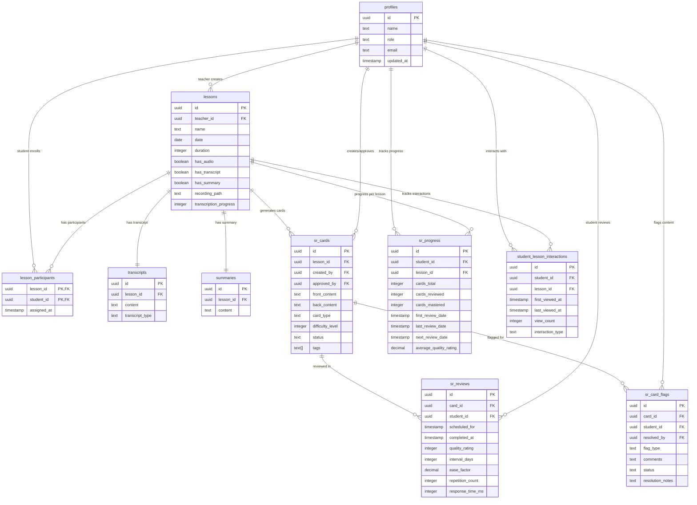

# Spaced Repetition Learning System - Complete Database Schema Documentation Plan

**Project**: Light Bus E-Learning Platform  
**Document Type**: Implementation Plan  
**Created**: 2025-06-01  
**Status**: Ready for Implementation  

## Executive Summary

This document outlines the comprehensive plan for creating complete technical documentation of the Spaced Repetition Learning System database schema. The system features 10 core tables, 43 Row Level Security policies, 60+ PostgreSQL functions, and implements the SM-2 spaced repetition algorithm for educational content delivery.

## System Overview

### Architecture Components
- **Database Engine**: PostgreSQL with advanced features
- **Security Model**: Row Level Security (RLS) with role-based access
- **Business Logic**: Server-side functions for all operations
- **Algorithm**: SM-2 spaced repetition implementation
- **Compliance**: FERPA and GDPR ready

### Key Statistics
- **Tables**: 10 core entities
- **Security Policies**: 43 comprehensive RLS policies
- **Functions**: 60+ organized business logic functions
- **Constraints**: Complete referential integrity
- **Indexes**: Performance-optimized query access

## Documentation Structure Plan

### Phase 1: Document Architecture & Navigation

#### 1.1 Master Document Structure
```markdown
# Complete Database Schema Overview
├── 1. Executive Summary
├── 2. System Architecture Overview
├── 3. Entity Relationship Diagrams
├── 4. Core Tables Documentation
├── 5. Security Model & RLS Policies
├── 6. Business Logic Functions
├── 7. Data Flow & Business Processes
├── 8. Performance & Optimization
├── 9. Implementation Guide
├── 10. Maintenance & Monitoring
└── 11. Appendices & References
```

#### 1.2 Visual Navigation System
- **Mermaid Diagrams**: Interactive entity relationships
- **Table Cross-References**: Hyperlinked navigation
- **Function Categories**: Organized by business domain
- **Security Matrix**: Role-based access visualization

### Phase 2: Core Schema Documentation

#### 2.1 Entity Specifications

**Table Documentation Template**:
```markdown
### Table: [table_name]
**Purpose**: [Business description]
**Security Level**: [Standard RLS | Forced RLS]
**Related Functions**: [List of associated functions]

| Column | Type | Constraints | Description |
|--------|------|-------------|-------------|
| ... | ... | ... | ... |

**Relationships**:
- Foreign Keys: [Details]
- Referenced By: [Details]
- Indexes: [Performance indexes]
```

**Complete Table List**:
1. [`profiles`](database/schema/tables/profiles.sql) - User management (teachers, students, admins)
2. [`lessons`](database/schema/tables/lessons.sql) - Core lesson content and metadata
3. [`lesson_participants`](database/schema/tables/lesson_participants.sql) - Student-lesson enrollment
4. [`transcripts`](database/schema/tables/transcripts.sql) - Audio/video transcription content
5. [`summaries`](database/schema/tables/summaries.sql) - AI-generated lesson summaries
6. [`sr_cards`](database/schema/tables/sr_cards.sql) - Spaced repetition flashcards
7. [`sr_card_flags`](database/schema/tables/sr_card_flags.sql) - Content moderation flags
8. [`sr_reviews`](database/schema/tables/sr_reviews.sql) - Individual review sessions
9. [`sr_progress`](database/schema/tables/sr_progress.sql) - Aggregated learning progress
10. [`student_lesson_interactions`](database/schema/tables/student_lesson_interactions.sql) - Engagement tracking

#### 2.2 Relationship Analysis

**Primary Relationships**:


#### 2.3 Constraint Documentation

**Constraint Categories**:
1. **Primary Keys**: UUID-based unique identifiers
2. **Foreign Keys**: Referential integrity with cascade rules
3. **Unique Constraints**: Business rule enforcement
4. **Check Constraints**: Data validation and enums
5. **Not Null Constraints**: Required field enforcement

### Phase 3: Security Model Documentation

#### 3.1 Row Level Security Overview

**Security Architecture**:


**Policy Distribution**:
| Table | Policies | RLS Type | Security Focus |
|-------|----------|----------|----------------|
| lesson_participants | 5 | Forced | Enrollment boundaries |
| lessons | 7 | Forced | Content ownership |
| profiles | 4 | Standard | User privacy |
| sr_card_flags | 7 | Standard | Content moderation |
| sr_cards | 8 | Standard | Learning content |
| sr_progress | 3 | Standard | Personal analytics |
| sr_reviews | 2 | Standard | Study privacy |
| student_lesson_interactions | 4 | Standard | Engagement tracking |
| summaries | 2 | Standard | Content access |
| transcripts | 7 | Forced | Audio/video privacy |

#### 3.2 Compliance Features

**Educational Privacy (FERPA)**:
- Student educational record protection
- Appropriate educational official access
- Directory information controls

**Data Protection (GDPR)**:
- User data ownership and control
- Right to access and deletion
- Consent management framework

### Phase 4: Business Logic Functions

#### 4.1 Function Categories

**1. User Management & Authentication** (8 functions)
- [`create_user_profile()`](database/functions/functions.sql:13)
- [`get_user_profile()`](database/functions/functions.sql:36)
- [`update_user_profile()`](database/functions/functions.sql:57)
- [`is_user_teacher()`](database/functions/functions.sql:79)
- [`get_user_stats()`](database/functions/functions.sql:98)

**2. Lesson Management & Recording** (10 functions)
- [`create_lesson()`](database/functions/functions.sql:130)
- [`add_lesson_participant()`](database/functions/functions.sql:158)
- [`remove_lesson_participant()`](database/functions/functions.sql:177)
- [`start_lesson_recording()`](database/functions/functions.sql:194)
- [`end_lesson_recording()`](database/functions/functions.sql:216)
- [`get_lesson_details()`](database/functions/functions.sql:238)
- [`get_user_lessons()`](database/functions/functions.sql:271)

**3. Spaced Repetition Algorithm** (8 functions)
- [`calculate_sr_interval()`](database/functions/functions.sql:305) - SM-2 algorithm
- [`record_sr_review()`](database/functions/functions.sql:348)
- [`get_cards_due()`](database/functions/functions.sql:406)
- [`get_sr_statistics()`](database/functions/functions.sql:441)
- [`get_user_study_streak()`](database/functions/functions.sql:468)

**4. Card Creation & Moderation** (8 functions)
- [`create_sr_card()`](database/functions/functions.sql:502)
- [`approve_sr_card()`](database/functions/functions.sql:525)
- [`reject_sr_card()`](database/functions/functions.sql:547)
- [`update_sr_card()`](database/functions/functions.sql:576)
- [`get_cards_for_moderation()`](database/functions/functions.sql:600)
- [`search_cards()`](database/functions/functions.sql:639)

**5. Progress Tracking & Analytics** (12 functions)
- [`get_lesson_analytics()`](database/functions/functions.sql:686)
- [`get_user_lesson_progress()`](database/functions/functions.sql:714)
- [`record_lesson_interaction()`](database/functions/functions.sql:746)
- [`get_user_learning_analytics()`](database/functions/functions.sql:773)

**6. Flag Management & Resolution** (6 functions)
- [`flag_card()`](database/functions/functions.sql:833)
- [`resolve_card_flag()`](database/functions/functions.sql:855)
- [`dismiss_card_flag()`](database/functions/functions.sql:879)
- [`get_pending_flags()`](database/functions/functions.sql:903)

**7. Student-Teacher Interaction** (4 functions)
- [`get_teacher_students()`](database/functions/functions.sql:947)
- [`get_student_teachers()`](database/functions/functions.sql:981)

**8. Transcription & Content Processing** (6 functions)
- [`create_transcript()`](database/functions/functions.sql:1018)
- [`update_transcript()`](database/functions/functions.sql:1040)
- [`create_summary()`](database/functions/functions.sql:1062)
- [`get_lesson_content()`](database/functions/functions.sql:1084)

**9. Utility & Helper Functions** (8 functions)
- [`system_health_check()`](database/functions/functions.sql:1128)
- [`get_database_stats()`](database/functions/functions.sql:1240)
- [`validate_card_content()`](database/functions/functions.sql:1270)
- [`cleanup_test_data()`](database/functions/functions.sql:1161)
- [`generate_sample_data()`](database/functions/functions.sql:1201)

#### 4.2 SM-2 Algorithm Implementation

**Algorithm Details**:
```sql
-- Core SM-2 calculation function
calculate_sr_interval(
    p_current_interval INTEGER,
    p_easiness_factor DECIMAL,
    p_quality INTEGER
)
```

**Quality Ratings**:
- 0: Complete blackout
- 1: Incorrect response, correct remembered
- 2: Incorrect response, correct seemed easy
- 3: Correct response, difficult
- 4: Correct response, some hesitation
- 5: Perfect response

### Phase 5: Visual Diagrams & Workflows

#### 5.1 Entity Relationship Diagram



#### 5.2 Security Architecture Diagram


#### 5.3 Business Process Flows

**Lesson Creation Flow**:


**Spaced Repetition Review Flow**:


### Phase 6: Implementation Guidelines

#### 6.1 Deployment Sequence

**1. Schema Creation**:
```sql
-- 1. Create tables
\i database/schema/complete_schema.sql

-- 2. Apply constraints
\i database/schema/constraints.sql

-- 3. Install functions
\i database/functions/functions.sql

-- 4. Apply security policies
\i database/policies/policies.sql

-- 5. Create triggers
\i database/triggers/triggers.sql
```

**2. Verification Steps**:
```sql
-- Verify schema
SELECT * FROM schema_version;

-- Check RLS status
SELECT * FROM get_rls_status();

-- Test functions
SELECT * FROM system_health_check();

-- Validate sample data
SELECT * FROM generate_sample_data();
```

#### 6.2 Performance Optimization

**Index Strategy**:
- **Primary Keys**: Automatic UUID indexes
- **Foreign Keys**: Performance indexes on all FK columns
- **Query Patterns**: Composite indexes for common queries
- **Time-based**: Indexes on timestamp columns for date ranges

**Query Optimization**:
- **Function Design**: Minimal complex subqueries
- **Join Patterns**: Optimized relationship traversal
- **Data Types**: Appropriate type selection for performance

#### 6.3 Maintenance Procedures

**Regular Tasks**:
- Monthly security policy review
- Quarterly performance analysis
- Database statistics updates
- Index maintenance and optimization

**Monitoring**:
- Policy effectiveness tracking
- Query performance monitoring
- Security audit logging
- Compliance verification

## Implementation Deliverables

### Primary Deliverable
**File**: `database_schema_complete_overview.md`
- Complete technical documentation
- All sections as outlined in this plan
- Interactive Mermaid diagrams
- Cross-referenced navigation

### Supporting Documents
1. **Quick Reference Guide**: Summary tables and API reference
2. **Implementation Checklist**: Step-by-step deployment guide
3. **Security Matrix**: Role-permission mapping
4. **Performance Guide**: Optimization recommendations

## Success Criteria

- [ ] All 10 tables fully documented with complete specifications
- [ ] All 43 security policies explained with business context
- [ ] All 60+ functions categorized and documented
- [ ] Visual diagrams accurately represent system architecture
- [ ] Implementation guide provides clear deployment steps
- [ ] Documentation serves both technical reference and educational purposes

## Next Steps

1. **Approve Plan**: Confirm all sections meet requirements
2. **Switch to Code Mode**: Begin implementation of documentation
3. **Generate Documentation**: Create comprehensive markdown file
4. **Review and Refine**: Iterate on documentation completeness
5. **Final Documentation**: Deliver complete schema overview

---

**Plan Status**: ✅ Ready for Implementation  
**Estimated Effort**: 2-3 hours for complete documentation  
**Complexity**: High - Enterprise-grade system documentation  
**Priority**: High - Essential for system understanding and maintenance