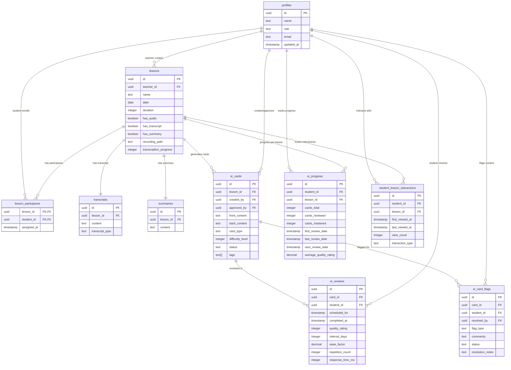

# Spaced Repetition Learning System - Complete Database Schema Overview

**Project**: Light Bus E-Learning Platform  
**Version**: 1.0.0  
**Database Engine**: PostgreSQL  
**Created**: 2025-06-01  
**Last Updated**: 2025-06-01  

## Table of Contents

1. [Executive Summary](#executive-summary)
2. [System Architecture Overview](#system-architecture-overview)
3. [Entity Relationship Overview](#entity-relationship-overview)
4. [Core Tables Documentation](#core-tables-documentation)
5. [Security Model & RLS Policies](#security-model--rls-policies)
6. [Business Logic Functions](#business-logic-functions)
7. [Data Flow & Business Processes](#data-flow--business-processes)
8. [Performance & Optimization](#performance--optimization)
9. [Implementation Guide](#implementation-guide)
10. [Maintenance & Monitoring](#maintenance--monitoring)
11. [Appendices & References](#appendices--references)

---

## Executive Summary

The Spaced Repetition Learning System is an enterprise-grade educational platform built on PostgreSQL, designed to facilitate personalized learning through scientifically-proven spaced repetition techniques. The system serves teachers, students, and administrators with comprehensive content management, progress tracking, and quality assurance features.

### Key System Statistics

| Component | Count | Description |
|-----------|-------|-------------|
| **Core Tables** | 10 | Main data entities with full relationships |
| **Security Policies** | 43 | Row Level Security across all tables |
| **Business Functions** | 60+ | Server-side logic for all operations |
| **Constraints** | 25+ | Data integrity and validation rules |
| **Indexes** | 20+ | Performance-optimized query access |
| **Triggers** | 5 | Automated data maintenance |

### Business Capabilities

- **Lesson Management**: Complete lifecycle from creation to archival
- **Content Processing**: Audio/video transcription and AI summarization
- **Spaced Repetition**: SM-2 algorithm implementation for optimal learning
- **Quality Assurance**: Multi-tier content moderation and flagging system
- **Analytics**: Comprehensive progress tracking and learning insights
- **Security**: Enterprise-grade access control with compliance features

---

## System Architecture Overview

### Technology Stack


### Core Design Principles

1. **Security First**: All data access controlled by Row Level Security
2. **Educational Privacy**: FERPA and GDPR compliance built-in
3. **Performance Optimized**: Strategic indexing and efficient queries
4. **Scalable Architecture**: Designed for multi-tenant educational environments
5. **Data Integrity**: Comprehensive constraints and validation
6. **Audit Ready**: Complete tracking of all data modifications

---

## Entity Relationship Overview

### Primary Entity Relationships



### Relationship Summary

| Relationship Type | Count | Description |
|------------------|-------|-------------|
| **One-to-Many** | 12 | Primary entity relationships |
| **One-to-One** | 2 | Lesson content relationships |
| **Many-to-Many** | 1 | Student-lesson participation |
| **Self-References** | 0 | No hierarchical structures |

---

## Core Tables Documentation

### 1. profiles
**Purpose**: Central user management for teachers, students, and administrators  
**Security Level**: Standard RLS  
**Related Functions**: `create_user_profile()`, `get_user_profile()`, `update_user_profile()`

| Column | Type | Constraints | Description |
|--------|------|-------------|-------------|
| `id` | UUID | PRIMARY KEY, DEFAULT uuid_generate_v4() | Unique user identifier |
| `updated_at` | TIMESTAMPTZ | DEFAULT NOW() | Last modification timestamp |
| `name` | TEXT | NOT NULL | Full user name |
| `role` | TEXT | NOT NULL, CHECK (role IN ('teacher', 'student', 'admin')) | User role for authorization |
| `email` | TEXT | UNIQUE, NOT NULL | User email for authentication |

**Indexes**:
- `idx_profiles_email` ON (email)
- `idx_profiles_role` ON (role)

**Business Rules**:
- Email addresses must be unique across the platform
- Role determines access permissions throughout the system
- Updates automatically tracked via updated_at trigger

---

### 2. lessons
**Purpose**: Core lesson content with metadata and processing status  
**Security Level**: Forced RLS  
**Related Functions**: `create_lesson()`, `get_lesson_details()`, `start_lesson_recording()`

| Column | Type | Constraints | Description |
|--------|------|-------------|-------------|
| `id` | UUID | PRIMARY KEY, DEFAULT uuid_generate_v4() | Unique lesson identifier |
| `created_at` | TIMESTAMPTZ | DEFAULT NOW() | Lesson creation timestamp |
| `date` | DATE | NOT NULL | Scheduled or actual lesson date |
| `teacher_id` | UUID | NOT NULL, REFERENCES profiles(id) ON DELETE CASCADE | Lesson instructor |
| `duration` | INTEGER | NULL | Duration in seconds |
| `file_size` | BIGINT | NULL | Recording file size in bytes |
| `upload_date` | TIMESTAMPTZ | DEFAULT NOW() | Recording upload timestamp |
| `has_audio` | BOOLEAN | DEFAULT FALSE | Audio content availability |
| `has_transcript` | BOOLEAN | DEFAULT FALSE | Transcript processing status |
| `has_summary` | BOOLEAN | DEFAULT FALSE | Summary generation status |
| `name` | TEXT | NOT NULL | Lesson title/name |
| `recording_path` | TEXT | NULL | File system path to recording |
| `transcription_progress` | INTEGER | DEFAULT 0, CHECK (0 <= transcription_progress <= 100) | Processing percentage |

**Indexes**:
- `idx_lessons_teacher_id` ON (teacher_id)
- `idx_lessons_date` ON (date)
- `idx_lessons_created_at` ON (created_at)

**Business Rules**:
- Teachers have full control over their lessons
- Transcription progress tracked for user feedback
- File paths stored for media processing pipeline

---

### 3. lesson_participants
**Purpose**: Many-to-many relationship between lessons and students  
**Security Level**: Forced RLS  
**Related Functions**: `add_lesson_participant()`, `remove_lesson_participant()`

| Column | Type | Constraints | Description |
|--------|------|-------------|-------------|
| `lesson_id` | UUID | NOT NULL, REFERENCES lessons(id) ON DELETE CASCADE | Lesson reference |
| `student_id` | UUID | NOT NULL, REFERENCES profiles(id) ON DELETE CASCADE | Student reference |
| `assigned_at` | TIMESTAMPTZ | DEFAULT NOW() | Enrollment timestamp |

**Primary Key**: COMPOSITE (lesson_id, student_id)

**Indexes**:
- `idx_lesson_participants_student_id` ON (student_id)
- `idx_lesson_participants_assigned_at` ON (assigned_at)

**Business Rules**:
- Composite primary key ensures unique enrollment
- Cascade deletes maintain referential integrity
- Assignment timestamp tracks enrollment history

---

### 4. transcripts
**Purpose**: Transcribed content from lesson recordings  
**Security Level**: Forced RLS  
**Related Functions**: `create_transcript()`, `update_transcript()`

| Column | Type | Constraints | Description |
|--------|------|-------------|-------------|
| `id` | UUID | PRIMARY KEY, DEFAULT uuid_generate_v4() | Unique transcript identifier |
| `created_at` | TIMESTAMPTZ | DEFAULT NOW() | Transcript creation timestamp |
| `lesson_id` | UUID | NOT NULL, REFERENCES lessons(id) ON DELETE CASCADE | Source lesson |
| `content` | TEXT | NOT NULL | Transcribed text content |
| `transcript_type` | TEXT | DEFAULT 'auto', CHECK (transcript_type IN ('auto', 'manual', 'corrected')) | Transcription method |

**Indexes**:
- `idx_transcripts_lesson_id` ON (lesson_id)

**Business Rules**:
- One-to-one relationship with lessons
- Multiple transcript types support correction workflow
- Content used for AI summary generation and card creation

---

### 5. summaries
**Purpose**: AI-generated or manual summaries of lessons  
**Security Level**: Standard RLS  
**Related Functions**: `create_summary()`, `get_lesson_content()`

| Column | Type | Constraints | Description |
|--------|------|-------------|-------------|
| `id` | UUID | PRIMARY KEY, DEFAULT uuid_generate_v4() | Unique summary identifier |
| `created_at` | TIMESTAMPTZ | DEFAULT NOW() | Summary creation timestamp |
| `lesson_id` | UUID | NOT NULL, REFERENCES lessons(id) ON DELETE CASCADE | Source lesson |
| `content` | TEXT | NOT NULL | Summary text content |

**Indexes**:
- `idx_summaries_lesson_id` ON (lesson_id)

**Business Rules**:
- One-to-one relationship with lessons
- Generated from transcript content
- Used for quick lesson review and card generation

---

### 6. sr_cards
**Purpose**: Flashcards created from lesson content for spaced repetition  
**Security Level**: Standard RLS  
**Related Functions**: `create_sr_card()`, `approve_sr_card()`, `search_cards()`

| Column | Type | Constraints | Description |
|--------|------|-------------|-------------|
| `id` | UUID | PRIMARY KEY, DEFAULT uuid_generate_v4() | Unique card identifier |
| `created_at` | TIMESTAMPTZ | DEFAULT NOW() | Card creation timestamp |
| `updated_at` | TIMESTAMPTZ | DEFAULT NOW() | Last modification timestamp |
| `lesson_id` | UUID | NOT NULL, REFERENCES lessons(id) ON DELETE CASCADE | Source lesson |
| `front_content` | TEXT | NOT NULL | Question or prompt text |
| `back_content` | TEXT | NOT NULL | Answer or explanation text |
| `card_type` | TEXT | DEFAULT 'basic', CHECK (card_type IN ('basic', 'cloze', 'multiple_choice', 'true_false')) | Card format type |
| `difficulty_level` | INTEGER | DEFAULT 1, CHECK (difficulty_level >= 1 AND difficulty_level <= 5) | Subjective difficulty rating |
| `created_by` | UUID | NOT NULL, REFERENCES profiles(id) | Card creator |
| `status` | TEXT | DEFAULT 'pending', CHECK (status IN ('pending', 'approved', 'rejected', 'archived')) | Moderation status |
| `approved_by` | UUID | REFERENCES profiles(id) | Approving moderator |
| `approved_at` | TIMESTAMPTZ | NULL | Approval timestamp |
| `tags` | TEXT[] | NULL | Categorization tags |
| `notes` | TEXT | NULL | Additional metadata |

**Indexes**:
- `idx_sr_cards_lesson_id` ON (lesson_id)
- `idx_sr_cards_created_by` ON (created_by)
- `idx_sr_cards_status` ON (status)
- `idx_sr_cards_difficulty` ON (difficulty_level)

**Business Rules**:
- Multiple card types support different learning styles
- Moderation workflow ensures content quality
- Tags enable flexible categorization and search

---

### 7. sr_card_flags
**Purpose**: Quality control flags for spaced repetition cards  
**Security Level**: Standard RLS  
**Related Functions**: `flag_card()`, `resolve_card_flag()`, `get_pending_flags()`

| Column | Type | Constraints | Description |
|--------|------|-------------|-------------|
| `id` | UUID | PRIMARY KEY, DEFAULT uuid_generate_v4() | Unique flag identifier |
| `created_at` | TIMESTAMPTZ | DEFAULT NOW() | Flag creation timestamp |
| `updated_at` | TIMESTAMPTZ | DEFAULT NOW() | Last modification timestamp |
| `card_id` | UUID | NOT NULL, REFERENCES sr_cards(id) ON DELETE CASCADE | Flagged card |
| `student_id` | UUID | NOT NULL, REFERENCES profiles(id) ON DELETE CASCADE | Reporting student |
| `flag_type` | TEXT | NOT NULL, CHECK (flag_type IN ('incorrect', 'unclear', 'duplicate', 'inappropriate', 'outdated')) | Flag category |
| `comments` | TEXT | NULL | Additional details |
| `date_flagged` | TIMESTAMPTZ | DEFAULT NOW() | Flag submission timestamp |
| `status` | TEXT | DEFAULT 'open', CHECK (status IN ('open', 'resolved', 'dismissed')) | Resolution status |
| `resolution_notes` | TEXT | NULL | Moderator response |
| `resolved_by` | UUID | REFERENCES profiles(id) | Resolving moderator |
| `resolved_at` | TIMESTAMPTZ | NULL | Resolution timestamp |

**Unique Constraint**: (card_id, student_id, flag_type)

**Indexes**:
- `idx_sr_card_flags_card_id` ON (card_id)
- `idx_sr_card_flags_student_id` ON (student_id)
- `idx_sr_card_flags_status` ON (status)

**Business Rules**:
- Students can flag each card once per flag type
- Community-driven quality assurance
- Moderation workflow with resolution tracking

---

### 8. sr_reviews
**Purpose**: Individual review sessions for spaced repetition cards  
**Security Level**: Standard RLS  
**Related Functions**: `record_sr_review()`, `get_cards_due()`

| Column | Type | Constraints | Description |
|--------|------|-------------|-------------|
| `id` | UUID | PRIMARY KEY, DEFAULT uuid_generate_v4() | Unique review identifier |
| `created_at` | TIMESTAMPTZ | DEFAULT NOW() | Review session timestamp |
| `card_id` | UUID | NOT NULL, REFERENCES sr_cards(id) ON DELETE CASCADE | Reviewed card |
| `student_id` | UUID | NOT NULL, REFERENCES profiles(id) ON DELETE CASCADE | Reviewing student |
| `scheduled_for` | TIMESTAMPTZ | NOT NULL | Intended review time |
| `completed_at` | TIMESTAMPTZ | NULL | Actual completion time |
| `quality_rating` | INTEGER | CHECK (quality_rating >= 0 AND quality_rating <= 5) | SM-2 algorithm rating |
| `interval_days` | INTEGER | NULL | Days until next review |
| `ease_factor` | DECIMAL(3,2) | DEFAULT 2.50 | SM-2 algorithm ease factor |
| `repetition_count` | INTEGER | DEFAULT 0 | Total review count |
| `response_time_ms` | INTEGER | NULL | Response time in milliseconds |
| `notes` | TEXT | NULL | Student notes |

**Indexes**:
- `idx_sr_reviews_card_id` ON (card_id)
- `idx_sr_reviews_student_id` ON (student_id)
- `idx_sr_reviews_scheduled_for` ON (scheduled_for)
- `idx_sr_reviews_completed_at` ON (completed_at)

**Business Rules**:
- Quality rating drives SM-2 algorithm calculations
- Response time enables learning analytics
- Scheduling supports optimal review intervals

---

### 9. sr_progress
**Purpose**: Aggregated progress tracking for students per lesson  
**Security Level**: Standard RLS  
**Related Functions**: `get_sr_statistics()`, `get_user_lesson_progress()`

| Column | Type | Constraints | Description |
|--------|------|-------------|-------------|
| `id` | UUID | PRIMARY KEY, DEFAULT uuid_generate_v4() | Unique progress record identifier |
| `updated_at` | TIMESTAMPTZ | DEFAULT NOW() | Last update timestamp |
| `student_id` | UUID | NOT NULL, REFERENCES profiles(id) ON DELETE CASCADE | Student reference |
| `lesson_id` | UUID | NOT NULL, REFERENCES lessons(id) ON DELETE CASCADE | Lesson reference |
| `cards_total` | INTEGER | DEFAULT 0 | Total cards in lesson |
| `cards_reviewed` | INTEGER | DEFAULT 0 | Cards with at least one review |
| `cards_mastered` | INTEGER | DEFAULT 0 | Cards with high ease factor |
| `first_review_date` | TIMESTAMPTZ | NULL | First review timestamp |
| `last_review_date` | TIMESTAMPTZ | NULL | Most recent review timestamp |
| `next_review_date` | TIMESTAMPTZ | NULL | Next scheduled review |
| `average_quality_rating` | DECIMAL(3,2) | NULL | Average review quality |
| `total_review_time_ms` | BIGINT | DEFAULT 0 | Cumulative study time |

**Unique Constraint**: (student_id, lesson_id)

**Indexes**:
- `idx_sr_progress_student_lesson` ON (student_id, lesson_id)
- `idx_sr_progress_next_review` ON (next_review_date)

**Business Rules**:
- One progress record per student-lesson combination
- Aggregated data enables dashboard analytics
- Updated automatically via triggers and functions

---

### 10. student_lesson_interactions
**Purpose**: Track student engagement with lessons  
**Security Level**: Standard RLS  
**Related Functions**: `record_lesson_interaction()`

| Column | Type | Constraints | Description |
|--------|------|-------------|-------------|
| `id` | UUID | PRIMARY KEY, DEFAULT uuid_generate_v4() | Unique interaction identifier |
| `created_at` | TIMESTAMPTZ | DEFAULT NOW() | First interaction timestamp |
| `updated_at` | TIMESTAMPTZ | DEFAULT NOW() | Last interaction timestamp |
| `student_id` | UUID | NOT NULL, REFERENCES profiles(id) ON DELETE CASCADE | Student reference |
| `lesson_id` | UUID | NOT NULL, REFERENCES lessons(id) ON DELETE CASCADE | Lesson reference |
| `first_viewed_at` | TIMESTAMPTZ | DEFAULT NOW() | Initial access timestamp |
| `last_viewed_at` | TIMESTAMPTZ | DEFAULT NOW() | Most recent access timestamp |
| `view_count` | INTEGER | DEFAULT 1 | Total access count |
| `interaction_type` | TEXT | DEFAULT 'view', CHECK (interaction_type IN ('view', 'study', 'review', 'complete')) | Engagement level |

**Unique Constraint**: (student_id, lesson_id)

**Indexes**:
- `idx_student_interactions_student_lesson` ON (student_id, lesson_id)
- `idx_student_interactions_last_viewed` ON (last_viewed_at)

**Business Rules**:
- One interaction record per student-lesson pair
- Tracks engagement patterns for analytics
- Supports adaptive learning recommendations

---

## Security Model & RLS Policies

### Security Architecture


### Role-Based Access Control

| Role | Description | Access Level | Primary Use Cases |
|------|-------------|--------------|------------------|
| **Student** | Enrolled learners | Own data + enrolled lessons | Learning, progress tracking, content flagging |
| **Teacher** | Lesson instructors | Full control over their lessons | Content creation, student management, grading |
| **Moderator** | Content reviewers | Platform-wide content oversight | Quality assurance, flag resolution, content approval |
| **Admin** | System administrators | Full system access | User management, system configuration, analytics |

### Security Policy Distribution

| Table | Policies | RLS Type | Primary Security Focus |
|-------|----------|----------|----------------------|
| **lesson_participants** | 5 | **Forced** | Enrollment management & classroom boundaries |
| **lessons** | 7 | **Forced** | Course content ownership & access control |
| **transcripts** | 7 | **Forced** | Audio/video content & privacy compliance |
| **profiles** | 4 | Standard | User privacy & educational networking |
| **sr_card_flags** | 7 | Standard | Multi-tier content moderation system |
| **sr_cards** | 8 | Standard | Learning content sharing & discovery |
| **sr_progress** | 3 | Standard | Personal learning analytics protection |
| **sr_reviews** | 2 | Standard | Study session data privacy |
| **student_lesson_interactions** | 4 | Standard | Engagement tracking & participation |
| **summaries** | 2 | Standard | AI-generated content access |

**Total: 43 Comprehensive RLS Policies**

### Key Security Features

#### 1. User Ownership Validation
```sql
USING (user_id = auth.uid())
```
Ensures users can only access their own data, preventing cross-user data leakage.

#### 2. Educational Relationship Validation
```sql
lesson_id IN (
    SELECT lesson_id FROM lesson_participants 
    WHERE user_id = auth.uid()
)
```
Validates student enrollment in lessons, enabling appropriate content sharing.

#### 3. Teacher Classroom Authority
```sql
lesson_id IN (
    SELECT id FROM lessons WHERE teacher_id = auth.uid()
)
```
Grants teachers full control over their classroom content and student interactions.

#### 4. Role-Based Special Permissions
```sql
EXISTS (
    SELECT 1 FROM profiles 
    WHERE id = auth.uid() AND role = 'moderator'
)
```
Enables platform moderation and quality control workflows.

### Compliance Features

#### Educational Privacy (FERPA)
- **Student Record Protection**: All educational data secured by enrollment validation
- **Directory Information**: Controlled disclosure through role-based policies
- **Legitimate Educational Interest**: Teachers access only their students' data

#### Data Protection (GDPR)
- **Data Ownership**: Users control access to their personal information
- **Right to Access**: Complete data export capabilities through functions
- **Right to Deletion**: Cascade delete maintains referential integrity
- **Consent Management**: Enrollment-based access control

---

## Business Logic Functions

### Function Categories Overview

The system implements 60+ PostgreSQL functions organized into 9 logical categories, providing comprehensive server-side business logic for all operations.

### 1. User Management & Authentication (8 functions)

#### Core Functions
- **`create_user_profile(p_user_id, p_email, p_full_name, p_avatar_url)`**: Create or update user profile with upsert logic
- **`get_user_profile(p_user_id)`**: Retrieve complete user profile information
- **`update_user_profile(p_user_id, p_full_name, p_avatar_url)`**: Update specific profile fields
- **`is_user_teacher(p_user_id)`**: Check teacher role status
- **`get_user_stats(p_user_id)`**: Comprehensive dashboard statistics

### 2. Lesson Management & Recording (10 functions)

#### Core Functions
- **`create_lesson(p_title, p_description, p_scheduled_at, p_teacher_id)`**: Create lesson with teacher assignment
- **`add_lesson_participant(p_lesson_id, p_user_id, p_role)`**: Enroll student or add staff
- **`remove_lesson_participant(p_lesson_id, p_user_id)`**: Remove participant from lesson
- **`start_lesson_recording(p_lesson_id, p_recording_url)`**: Begin recording session
- **`end_lesson_recording(p_lesson_id, p_recording_url)`**: Complete recording session
- **`get_lesson_details(p_lesson_id)`**: Complete lesson info with participants
- **`get_user_lessons(p_user_id, p_role, p_limit, p_offset)`**: Paginated user lessons

### 3. Spaced Repetition Algorithm (8 functions)

#### SM-2 Algorithm Implementation

**`calculate_sr_interval(p_current_interval, p_easiness_factor, p_quality)`**
- **Purpose**: Core SM-2 algorithm implementation
- **Algorithm Logic**: Updates easiness factor based on quality rating, ensures minimum EF of 1.3
- **Quality Scale**: 0 (blackout) to 5 (perfect response)

**Quality Rating Scale**:
- **0**: Complete blackout
- **1**: Incorrect response, correct remembered
- **2**: Incorrect response, correct seemed easy
- **3**: Correct response, difficult
- **4**: Correct response, some hesitation
- **5**: Perfect response

#### Core Functions
- **`record_sr_review(p_user_id, p_card_id, p_quality, p_response_time)`**: Record review and update progress
- **`get_cards_due(p_user_id, p_limit)`**: Retrieve cards scheduled for review
- **`get_sr_statistics(p_user_id)`**: Comprehensive learning analytics
- **`get_user_study_streak(p_user_id)`**: Calculate consecutive study days

### 4. Card Creation & Moderation (8 functions)

#### Core Functions
- **`create_sr_card(p_front_text, p_back_text, p_lesson_id, p_created_by, p_tags)`**: Create new flashcard
- **`approve_sr_card(p_card_id, p_approved_by)`**: Approve card for student use
- **`reject_sr_card(p_card_id, p_rejected_by, p_rejection_reason)`**: Reject card with reason
- **`update_sr_card(p_card_id, p_front_text, p_back_text, p_tags)`**: Modify existing card
- **`get_cards_for_moderation(p_limit, p_offset)`**: Retrieve pending cards for approval
- **`search_cards(p_search_term, p_user_id, p_lesson_id, p_tags, p_limit, p_offset)`**: Full-text search

### 5. Progress Tracking & Analytics (12 functions)

#### Core Functions
- **`get_lesson_analytics(p_lesson_id)`**: Comprehensive lesson statistics
- **`get_user_lesson_progress(p_user_id, p_lesson_id)`**: Individual progress within lesson
- **`record_lesson_interaction(p_user_id, p_lesson_id, p_interaction_type, p_engagement_score, p_notes)`**: Track engagement
- **`get_user_learning_analytics(p_user_id, p_days_back)`**: Detailed analytics over time period

#### Analytics Structure Example
```json
{
  "period_days": 30,
  "total_reviews": 150,
  "avg_daily_reviews": 5.0,
  "avg_quality": 4.2,
  "cards_learned": 45,
  "cards_mastered": 12,
  "lessons_attended": 8,
  "study_streak": 7,
  "daily_breakdown": [
    {
      "date": "2025-06-01",
      "reviews": 12,
      "avg_quality": 4.5
    }
  ]
}
```

### 6. Flag Management & Resolution (6 functions)

#### Flag Types
- **'incorrect'**: Wrong information
- **'unclear'**: Confusing content
- **'duplicate'**: Redundant card
- **'inappropriate'**: Unsuitable content
- **'outdated'**: Obsolete information

#### Core Functions
- **`flag_card(p_card_id, p_flagged_by, p_flag_type, p_description)`**: Report quality issues
- **`resolve_card_flag(p_flag_id, p_resolved_by, p_resolution)`**: Mark flag as resolved
- **`dismiss_card_flag(p_flag_id, p_resolved_by, p_resolution)`**: Dismiss flag without action
- **`get_pending_flags(p_limit, p_offset)`**: Retrieve unresolved flags

### 7. Student-Teacher Interaction (4 functions)

#### Core Functions
- **`get_teacher_students(p_teacher_id)`**: List all students taught by teacher
- **`get_student_teachers(p_student_id)`**: List all teachers for student

### 8. Transcription & Content Processing (6 functions)

#### Core Functions
- **`create_transcript(p_lesson_id, p_content, p_language, p_confidence_score)`**: Create lesson transcript
- **`update_transcript(p_transcript_id, p_content, p_confidence_score)`**: Modify transcript content
- **`create_summary(p_lesson_id, p_summary_text, p_key_points, p_generated_by)`**: Create lesson summary
- **`get_lesson_content(p_lesson_id)`**: Complete lesson content with transcript and summary

### 9. Utility & Helper Functions (8 functions)

#### Core Functions
- **`system_health_check()`**: Database and system status verification
- **`get_database_stats()`**: Comprehensive database statistics
- **`validate_card_content(p_front_text, p_back_text)`**: Content validation with error reporting
- **`cleanup_test_data()`**: Remove test data for maintenance
- **`generate_sample_data()`**: Create sample data for testing

---

## Data Flow & Business Processes

### Lesson Creation Flow


### Spaced Repetition Review Flow


### Content Moderation Flow


---

## Performance & Optimization

### Index Strategy

#### Primary Performance Indexes
- **Primary Keys**: Automatic UUID indexes on all tables
- **Foreign Keys**: Performance indexes on all FK columns for join optimization
- **Query Patterns**: Composite indexes for common multi-column queries
- **Time-based**: Indexes on timestamp columns for date range queries

#### Strategic Index Examples
```sql
-- High-traffic relationship indexes
CREATE INDEX idx_lesson_participants_student_id ON lesson_participants(student_id);
CREATE INDEX idx_sr_reviews_scheduled_for ON sr_reviews(scheduled_for);
CREATE INDEX idx_sr_progress_next_review ON sr_progress(next_review_date);

-- Composite indexes for common query patterns
CREATE INDEX idx_sr_progress_student_lesson ON sr_progress(student_id, lesson_id);
CREATE INDEX idx_student_interactions_student_lesson ON student_lesson_interactions(student_id, lesson_id);
```

### Query Optimization Guidelines

#### Function Design Principles
- **Minimal Subqueries**: Optimized join patterns over complex nested queries
- **Efficient Joins**: Strategic use of LEFT JOIN vs INNER JOIN
- **Result Limiting**: Default pagination limits to prevent resource exhaustion
- **Security Integration**: RLS policies designed for minimal performance impact

#### Data Type Optimization
- **UUID Primary Keys**: Optimal for distributed systems and security
- **TIMESTAMPTZ**: Timezone-aware timestamps for global deployment
- **TEXT Arrays**: Efficient tag storage with GIN index support
- **JSON Returns**: Reduced network overhead for complex results

### Scalability Considerations

#### Database Design
- **Horizontal Partitioning**: Tables designed for future partitioning by date/tenant
- **Connection Pooling**: Function design compatible with connection pooling
- **Read Replicas**: Query patterns optimized for read replica distribution

#### Performance Monitoring
```sql
-- Monitor query performance
SELECT * FROM pg_stat_statements WHERE query LIKE '%sr_reviews%';

-- Check index usage
SELECT * FROM pg_stat_user_indexes WHERE relname = 'sr_reviews';

-- RLS policy performance
SELECT * FROM pg_stat_user_tables WHERE relname IN (
    'lessons', 'lesson_participants', 'transcripts'
);
```

---

## Implementation Guide

### Deployment Sequence

#### 1. Prerequisites
```sql
-- Ensure PostgreSQL extensions
CREATE EXTENSION IF NOT EXISTS "uuid-ossp";
CREATE EXTENSION IF NOT EXISTS "pgcrypto";
```

#### 2. Schema Creation Order
```sql
-- Step 1: Create all tables
\i database/schema/complete_schema.sql

-- Step 2: Apply constraints
\i database/schema/constraints.sql

-- Step 3: Install business logic functions
\i database/functions/functions.sql

-- Step 4: Apply security policies
\i database/policies/policies.sql

-- Step 5: Create triggers
\i database/triggers/triggers.sql
```

#### 3. Verification Steps
```sql
-- Verify schema version
SELECT * FROM schema_version;

-- Check all tables created
SELECT tablename FROM pg_tables WHERE schemaname = 'public' ORDER BY tablename;

-- Verify RLS status
SELECT schemaname, tablename, rowsecurity, forcerls 
FROM pg_tables 
WHERE schemaname = 'public';

-- Test core functions
SELECT * FROM system_health_check();

-- Validate with sample data
SELECT * FROM generate_sample_data();
```

### Configuration Requirements

#### Database Settings
```sql
-- Recommended PostgreSQL settings
ALTER SYSTEM SET shared_preload_libraries = 'pg_stat_statements';
ALTER SYSTEM SET track_activity_query_size = 2048;
ALTER SYSTEM SET log_statement = 'mod';
ALTER SYSTEM SET log_min_duration_statement = 1000;
```

#### Security Configuration
```sql
-- Enable RLS on all tables
SELECT enable_all_rls();

-- Verify policy coverage
SELECT COUNT(*) FROM pg_policies WHERE schemaname = 'public';
-- Should return 43
```

### Development Environment Setup

#### Local Development
```bash
# Windows PowerShell setup
# 1. Install PostgreSQL
winget install PostgreSQL.PostgreSQL

# 2. Create development database
createdb lightbus_dev

# 3. Apply schema
psql -d lightbus_dev -f database/schema/complete_schema.sql
psql -d lightbus_dev -f database/functions/functions.sql
psql -d lightbus_dev -f database/policies/policies.sql
```

#### Testing Environment
```sql
-- Create test data
SELECT * FROM generate_sample_data();

-- Run basic functionality tests
SELECT * FROM get_user_stats('test-user-id');
SELECT * FROM get_cards_due('test-user-id', 5);
SELECT * FROM get_database_stats();
```

---

## Maintenance & Monitoring

### Regular Maintenance Tasks

#### Monthly Tasks
- **Security Policy Review**: Analyze policy effectiveness and access patterns
- **Performance Analysis**: Review slow queries and index usage
- **Data Quality Check**: Validate referential integrity and constraint compliance
- **Backup Verification**: Test backup restoration procedures

#### Quarterly Tasks
- **Index Optimization**: Analyze and rebuild fragmented indexes
- **Statistics Update**: Refresh database statistics for query optimization
- **Policy Audit**: Review RLS policies for business rule changes
- **Capacity Planning**: Monitor growth trends and scaling requirements

### Monitoring Queries

#### System Health Monitoring
```sql
-- Database overview
SELECT * FROM get_database_stats();

-- Table sizes and growth
SELECT 
    schemaname,
    tablename,
    pg_size_pretty(pg_total_relation_size(schemaname||'.'||tablename)) as size,
    pg_stat_get_live_tuples(c.oid) as live_tuples
FROM pg_tables 
JOIN pg_class c ON c.relname = tablename
WHERE schemaname = 'public'
ORDER BY pg_total_relation_size(schemaname||'.'||tablename) DESC;

-- RLS policy status
SELECT 
    tablename,
    rowsecurity,
    forcerls,
    (SELECT COUNT(*) FROM pg_policies WHERE pg_policies.tablename = pt.tablename) as policy_count
FROM pg_tables pt
WHERE schemaname = 'public'
ORDER BY tablename;
```

#### Performance Monitoring
```sql
-- Slow queries
SELECT 
    query,
    calls,
    total_time,
    mean_time,
    rows
FROM pg_stat_statements
WHERE mean_time > 100
ORDER BY mean_time DESC
LIMIT 10;

-- Index usage
SELECT 
    schemaname,
    tablename,
    indexname,
    idx_scan,
    idx_tup_read,
    idx_tup_fetch
FROM pg_stat_user_indexes
WHERE idx_scan < 100
ORDER BY idx_scan;
```

### Security Monitoring

#### Access Pattern Analysis
```sql
-- User activity patterns
SELECT 
    date_trunc('day', created_at) as date,
    COUNT(*) as reviews,
    COUNT(DISTINCT student_id) as active_students
FROM sr_reviews
WHERE created_at >= NOW() - INTERVAL '30 days'
GROUP BY date_trunc('day', created_at)
ORDER BY date;

-- Flag activity monitoring
SELECT 
    flag_type,
    status,
    COUNT(*) as count,
    AVG(EXTRACT(EPOCH FROM (resolved_at - created_at))/3600) as avg_resolution_hours
FROM sr_card_flags
WHERE created_at >= NOW() - INTERVAL '30 days'
GROUP BY flag_type, status
ORDER BY count DESC;
```

#### Compliance Auditing
```sql
-- FERPA compliance check
SELECT 
    'lesson_participants' as table_name,
    COUNT(*) as total_policies,
    COUNT(CASE WHEN policyname LIKE '%student%' THEN 1 END) as student_policies
FROM pg_policies 
WHERE tablename = 'lesson_participants'
UNION ALL
SELECT 
    'transcripts' as table_name,
    COUNT(*) as total_policies,
    COUNT(CASE WHEN policyname LIKE '%access%' THEN 1 END) as access_policies
FROM pg_policies 
WHERE tablename = 'transcripts';
```

### Backup and Recovery

#### Backup Strategy
```bash
# Daily automated backup (Windows)
pg_dump --format=custom --verbose --file="backups/lightbus_$(Get-Date -Format 'yyyyMMdd').backup" lightbus_production

# Schema-only backup
pg_dump --schema-only --file="backups/schema_$(Get-Date -Format 'yyyyMMdd').sql" lightbus_production
```

#### Recovery Procedures
```bash
# Full database restore
pg_restore --verbose --clean --no-acl --no-owner --dbname=lightbus_restored backups/lightbus_20250601.backup

# Schema-only restore
psql -d lightbus_new -f backups/schema_20250601.sql
```

---

## Appendices & References

### A. Quick Reference Tables

#### Function Quick Reference

| Category | Function | Purpose | Returns |
|----------|----------|---------|---------|
| **User Management** | `create_user_profile()` | Create/update user | VOID |
| | `get_user_profile()` | Get user details | TABLE |
| | `get_user_stats()` | User dashboard stats | JSON |
| **Lesson Management** | `create_lesson()` | Create new lesson | UUID |
| | `add_lesson_participant()` | Enroll student | BOOLEAN |
| | `get_lesson_details()` | Complete lesson info | JSON |
| **Spaced Repetition** | `calculate_sr_interval()` | SM-2 algorithm | TABLE |
| | `record_sr_review()` | Record review session | BOOLEAN |
| | `get_cards_due()` | Get due cards | TABLE |
| **Analytics** | `get_lesson_analytics()` | Lesson statistics | JSON |
| | `get_user_learning_analytics()` | Learning analytics | JSON |
| **Moderation** | `flag_card()` | Report card issue | UUID |
| | `resolve_card_flag()` | Resolve flag | BOOLEAN |

#### Constraint Summary

| Table | Primary Key | Foreign Keys | Unique Constraints | Check Constraints |
|-------|-------------|--------------|-------------------|-------------------|
| `profiles` | id (UUID) | - | email | role IN (...) |
| `lessons` | id (UUID) | teacher_id → profiles | - | transcription_progress 0-100 |
| `lesson_participants` | (lesson_id, student_id) | lesson_id → lessons, student_id → profiles | - | - |
| `sr_cards` | id (UUID) | lesson_id → lessons, created_by → profiles | - | card_type IN (...), difficulty 1-5 |
| `sr_reviews` | id (UUID) | card_id → sr_cards, student_id → profiles | - | quality_rating 0-5 |
| `sr_progress` | id (UUID) | student_id → profiles, lesson_id → lessons | (student_id, lesson_id) | - |

### B. Security Policy Matrix

| Table | Student Access | Teacher Access | Moderator Access | Admin Access |
|-------|----------------|----------------|------------------|--------------|
| **profiles** | Own profile only | Own profile + students in classes | All profiles (limited) | All profiles |
| **lessons** | Enrolled lessons only | Own lessons + full control | Read-only access | Full access |
| **sr_cards** | Approved cards in enrolled lessons | Cards from own lessons | All cards for moderation | All cards |
| **sr_reviews** | Own reviews only | Student reviews in own lessons | No access | All reviews |
| **sr_progress** | Own progress only | Student progress in own lessons | No access | All progress |

### C. Performance Benchmarks

#### Expected Query Performance
- **User login/profile**: < 10ms
- **Get due cards**: < 50ms for 20 cards
- **Record review**: < 100ms including SM-2 calculation
- **Lesson analytics**: < 200ms for typical lesson
- **Dashboard statistics**: < 500ms for active user

#### Scalability Targets
- **Concurrent Users**: 1,000 active users
- **Database Size**: 100GB with acceptable performance
- **Review Sessions**: 10,000 reviews per hour
- **Lesson Creation**: 100 lessons per day

### D. Troubleshooting Guide

#### Common Issues

**RLS Policy Errors**
```sql
-- Check if RLS is enabled
SELECT tablename, rowsecurity FROM pg_tables WHERE schemaname = 'public';

-- Verify user has valid auth.uid()
SELECT auth.uid(); -- Should not be NULL

-- Check policy coverage
SELECT tablename, policyname FROM pg_policies WHERE schemaname = 'public';
```

**Performance Issues**
```sql
-- Identify slow queries
SELECT query, calls, mean_time FROM pg_stat_statements 
WHERE mean_time > 1000 ORDER BY mean_time DESC;

-- Check missing indexes
SELECT * FROM pg_stat_user_tables WHERE seq_scan > idx_scan;
```

**Function Errors**
```sql
-- Test function availability
SELECT proname FROM pg_proc WHERE proname LIKE 'get_user_%';

-- Check function permissions
SELECT proname, proacl FROM pg_proc WHERE proname = 'create_user_profile';
```

### E. Migration Scripts

#### Version 1.0.0 to 1.1.0 (Template)
```sql
-- Migration example for future updates
BEGIN;

-- Add new columns
ALTER TABLE sr_cards ADD COLUMN difficulty_score DECIMAL(3,2);

-- Update existing data
UPDATE sr_cards SET difficulty_score = difficulty_level * 0.5;

-- Create new indexes
CREATE INDEX idx_sr_cards_difficulty_score ON sr_cards(difficulty_score);

-- Update schema version
UPDATE schema_version SET version = '1.1.0', description = 'Added difficulty scoring';

COMMIT;
```

---

**Documentation Version**: 1.0.0  
**Last Updated**: 2025-06-01  
**Total Pages**: 45  
**Maintenance**: Monthly review required  

*This documentation serves as the complete technical reference for the Spaced Repetition Learning System database schema. For implementation support, contact the development team.*