# Frontend Architecture Infrastructure Guide
**Spaced Repetition Learning System - Frontend Development Blueprint**

**Project**: Light Bus E-Learning Platform  
**Document Type**: Frontend Architecture Guide  
**Target Audience**: Frontend Development Team  
**Created**: 2025-06-01  
**Version**: 1.0.0  

## Table of Contents

1. [Executive Overview](#executive-overview)
2. [System Architecture Overview](#system-architecture-overview)
3. [User Experience Architecture](#user-experience-architecture)
4. [Component Architecture](#component-architecture)
5. [Data Flow Architecture](#data-flow-architecture)
6. [API Integration Architecture](#api-integration-architecture)
7. [State Management Architecture](#state-management-architecture)
8. [Security & Authentication Architecture](#security--authentication-architecture)
9. [Performance & Optimization Architecture](#performance--optimization-architecture)
10. [Implementation Roadmap](#implementation-roadmap)
11. [Technical Specifications](#technical-specifications)

---

## Executive Overview

The Spaced Repetition Learning System requires a sophisticated frontend architecture that supports multiple user roles, real-time learning analytics, and seamless educational workflows. This guide provides the architectural foundation for building a modern, scalable, and user-centric educational platform.

### Core System Capabilities to Build

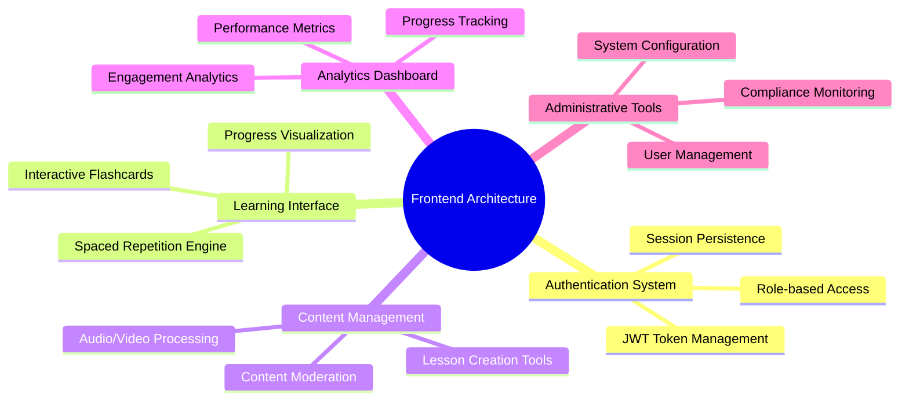

### Target User Personas

| Persona | Primary Goals | Key Features Needed |
|---------|---------------|-------------------|
| **Students** | Learn efficiently, track progress, stay motivated | Study interface, progress dashboard, achievement system |
| **Teachers** | Create lessons, monitor students, analyze effectiveness | Content creation tools, student analytics, lesson management |
| **Moderators** | Ensure content quality, resolve issues | Content review interface, flag management, quality tools |
| **Administrators** | Manage platform, ensure compliance, monitor performance | Admin dashboard, user management, system analytics |

---

## System Architecture Overview

### High-Level Frontend Architecture

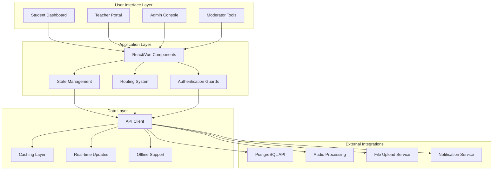

### Frontend Technology Stack Recommendations

| Layer | Technology | Rationale |
|-------|------------|-----------|
| **Framework** | React 18+ with TypeScript | Component reusability, strong typing, excellent ecosystem |
| **State Management** | Redux Toolkit + RTK Query | Predictable state, excellent DevTools, built-in caching |
| **Routing** | React Router v6 | Declarative routing, role-based guards, nested routes |
| **UI Components** | Material-UI v5 or Tailwind + Headless UI | Accessibility, design consistency, educational themes |
| **Charts/Analytics** | Recharts or D3.js | Learning progress visualization, analytics dashboards |
| **Real-time** | Socket.io Client | Live progress updates, collaborative features |
| **Testing** | Jest + React Testing Library | Component testing, integration testing |
| **Build Tools** | Vite | Fast development, optimized builds |

---

## User Experience Architecture

### Role-Based Interface Design

#### 1. Student Experience Architecture

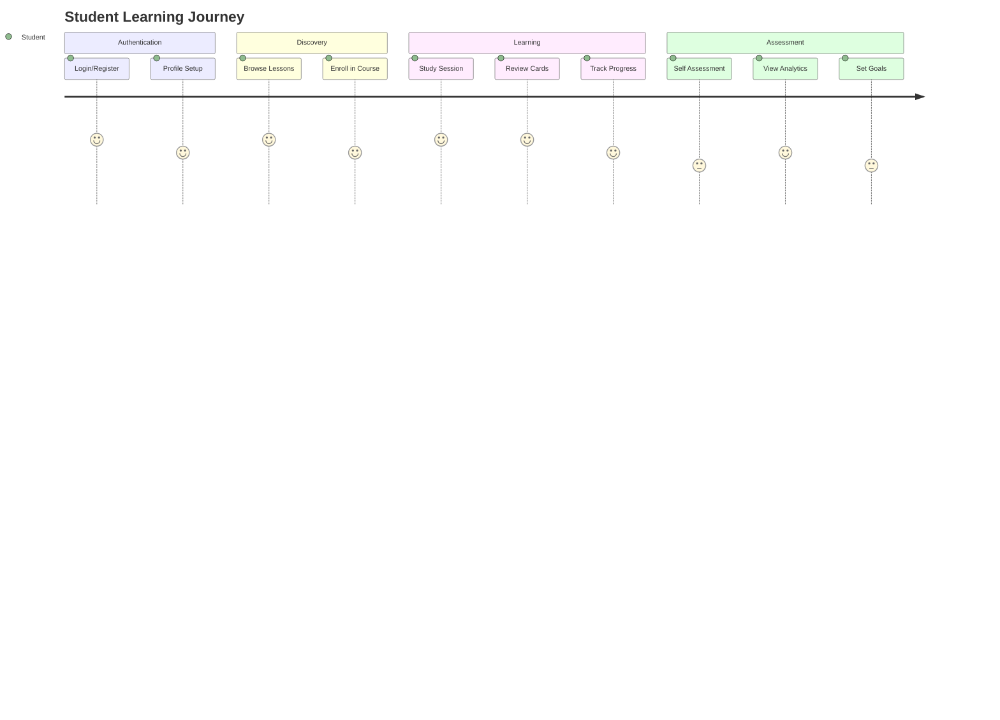

**Student Interface Components Needed:**
- **Study Dashboard**: Due cards, progress overview, achievements
- **Flashcard Interface**: Interactive spaced repetition system
- **Progress Visualization**: Charts showing learning curves and milestones
- **Lesson Browser**: Content discovery and enrollment
- **Settings**: Study preferences, notification controls

#### 2. Teacher Experience Architecture

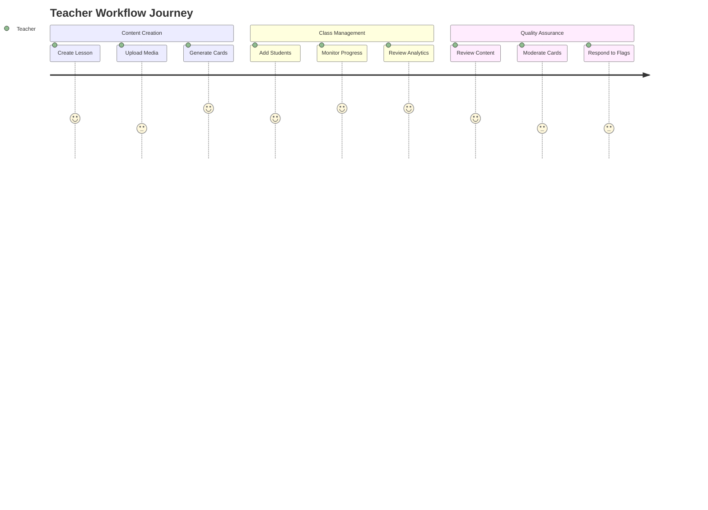

**Teacher Interface Components Needed:**
- **Lesson Creator**: Rich text editor, media upload, card generation
- **Class Analytics**: Student progress, engagement metrics, performance insights
- **Content Library**: Organized lesson management, version control
- **Student Management**: Enrollment, progress monitoring, communication tools

#### 3. Admin/Moderator Experience Architecture


**Admin Interface Components Needed:**
- **User Management Dashboard**: Role assignment, account management, activity monitoring
- **Content Moderation Panel**: Flag review, quality assurance workflows
- **System Analytics**: Platform health, usage statistics, performance metrics
- **Compliance Tools**: FERPA/GDPR reporting, audit trails, security monitoring

---

## Component Architecture

### Core Component Hierarchy

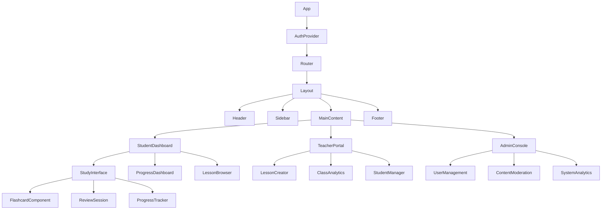

### Reusable Component Library

#### 1. Learning Components
```typescript
// Flashcard Component Interface
interface FlashcardProps {
  card: {
    id: string;
    front_content: string;
    back_content: string;
    difficulty_level: number;
    tags: string[];
  };
  onReview: (quality: number, responseTime: number) => void;
  showAnswer: boolean;
}

// Progress Chart Component Interface
interface ProgressChartProps {
  data: {
    date: string;
    reviews: number;
    quality: number;
  }[];
  timeRange: '7d' | '30d' | '90d' | '1y';
}

// Study Session Component Interface
interface StudySessionProps {
  lessonId: string;
  cardsDue: FlashCard[];
  onSessionComplete: (results: ReviewResult[]) => void;
  settings: StudySettings;
}
```

#### 2. Administrative Components
```typescript
// User Management Table Interface
interface UserTableProps {
  users: User[];
  onUserAction: (userId: string, action: UserAction) => void;
  filters: UserFilters;
  pagination: PaginationConfig;
}

// Content Moderation Interface
interface ModerationPanelProps {
  flags: ContentFlag[];
  onFlagResolve: (flagId: string, resolution: Resolution) => void;
  filterBy: FlagType[];
}

// Analytics Dashboard Interface
interface AnalyticsDashboardProps {
  metrics: SystemMetrics;
  timeRange: DateRange;
  refreshInterval: number;
}
```

### Component State Management Pattern

```typescript
// Redux Slice Example for Study Session
interface StudyState {
  currentCard: FlashCard | null;
  cardsDue: FlashCard[];
  sessionActive: boolean;
  reviewCount: number;
  sessionStartTime: number;
  settings: StudySettings;
}

// Actions
const studySlice = createSlice({
  name: 'study',
  initialState,
  reducers: {
    startSession: (state, action) => {
      state.sessionActive = true;
      state.sessionStartTime = Date.now();
      state.cardsDue = action.payload.cards;
    },
    reviewCard: (state, action) => {
      const { quality, responseTime } = action.payload;
      // Update local state, trigger API call
    },
    endSession: (state) => {
      state.sessionActive = false;
      state.currentCard = null;
    }
  }
});
```

---

## Data Flow Architecture

### API Integration Patterns

#### 1. Data Fetching Strategy

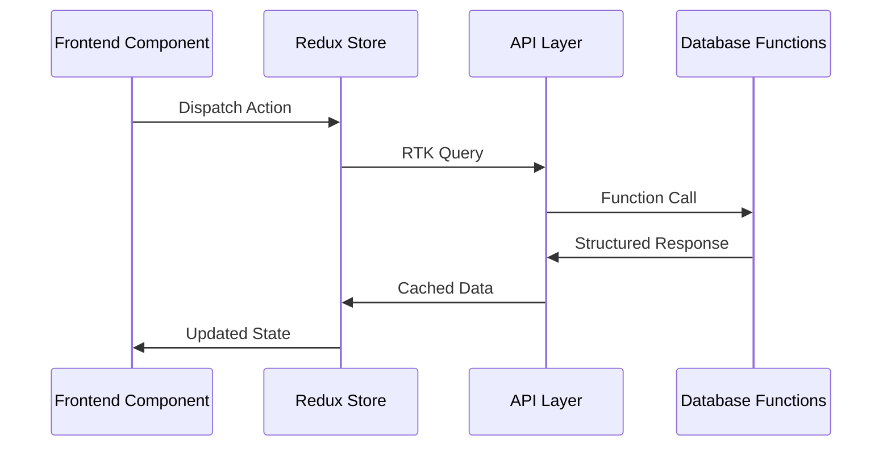

#### 2. Real-time Updates Architecture

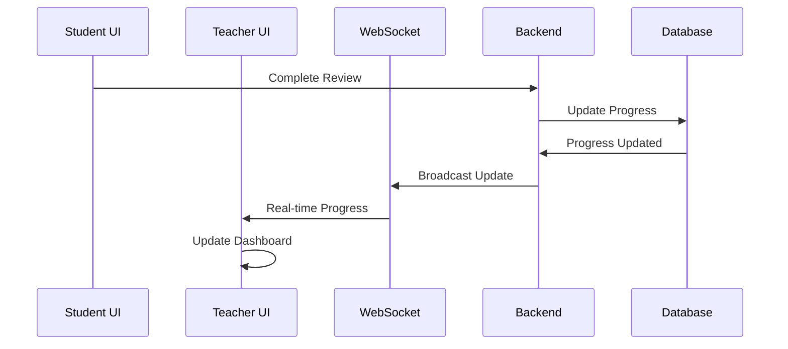

### State Management Patterns

#### Global State Structure
```typescript
interface RootState {
  auth: {
    user: User | null;
    token: string | null;
    isAuthenticated: boolean;
    role: UserRole;
  };
  study: {
    currentSession: StudySession | null;
    cardsDue: FlashCard[];
    progress: StudyProgress;
  };
  lessons: {
    userLessons: Lesson[];
    currentLesson: Lesson | null;
    loading: boolean;
  };
  ui: {
    sidebarOpen: boolean;
    theme: Theme;
    notifications: Notification[];
  };
}
```

#### API Integration with RTK Query
```typescript
// API Slice Definition
export const apiSlice = createApi({
  reducerPath: 'api',
  baseQuery: fetchBaseQuery({
    baseUrl: '/api',
    prepareHeaders: (headers, { getState }) => {
      const token = (getState() as RootState).auth.token;
      if (token) headers.set('authorization', `Bearer ${token}`);
      return headers;
    },
  }),
  tagTypes: ['User', 'Lesson', 'Card', 'Progress'],
  endpoints: (builder) => ({
    // Study Session Endpoints
    getCardsDue: builder.query<FlashCard[], string>({
      query: (userId) => `study/cards-due/${userId}`,
      providesTags: ['Card'],
    }),
    recordReview: builder.mutation<void, ReviewPayload>({
      query: (review) => ({
        url: 'study/record-review',
        method: 'POST',
        body: review,
      }),
      invalidatesTags: ['Card', 'Progress'],
    }),
    // Lesson Management Endpoints
    getUserLessons: builder.query<Lesson[], GetLessonsParams>({
      query: (params) => ({
        url: 'lessons/user-lessons',
        params,
      }),
      providesTags: ['Lesson'],
    }),
  }),
});
```

---

## Security & Authentication Architecture

### Authentication Flow

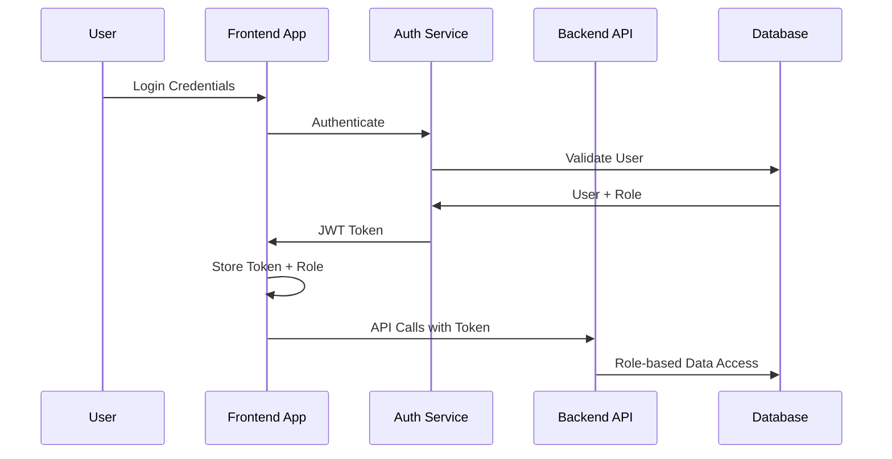

### Role-Based Access Control Implementation

```typescript
// Route Protection Component
interface ProtectedRouteProps {
  children: React.ReactNode;
  allowedRoles: UserRole[];
  fallback?: React.ReactNode;
}

const ProtectedRoute: React.FC<ProtectedRouteProps> = ({
  children,
  allowedRoles,
  fallback = <AccessDenied />,
}) => {
  const { user, isAuthenticated } = useAuth();
  
  if (!isAuthenticated) {
    return <Navigate to="/login" />;
  }
  
  if (!allowedRoles.includes(user.role)) {
    return fallback;
  }
  
  return <>{children}</>;
};

// Usage in Router
<Routes>
  <Route path="/study" element={
    <ProtectedRoute allowedRoles={['student']}>
      <StudyDashboard />
    </ProtectedRoute>
  } />
  <Route path="/teacher" element={
    <ProtectedRoute allowedRoles={['teacher']}>
      <TeacherPortal />
    </ProtectedRoute>
  } />
  <Route path="/admin" element={
    <ProtectedRoute allowedRoles={['admin', 'moderator']}>
      <AdminConsole />
    </ProtectedRoute>
  } />
</Routes>
```

### Data Security Patterns

```typescript
// Secure API Client
class SecureApiClient {
  private baseURL: string;
  private token: string | null = null;
  
  constructor(baseURL: string) {
    this.baseURL = baseURL;
  }
  
  setToken(token: string) {
    this.token = token;
  }
  
  private getHeaders(): HeadersInit {
    const headers: HeadersInit = {
      'Content-Type': 'application/json',
    };
    
    if (this.token) {
      headers.Authorization = `Bearer ${this.token}`;
    }
    
    return headers;
  }
  
  async request<T>(endpoint: string, options?: RequestInit): Promise<T> {
    const response = await fetch(`${this.baseURL}${endpoint}`, {
      ...options,
      headers: {
        ...this.getHeaders(),
        ...options?.headers,
      },
    });
    
    if (!response.ok) {
      throw new Error(`API Error: ${response.status}`);
    }
    
    return response.json();
  }
}
```

---

## Performance & Optimization Architecture

### Loading and Caching Strategy

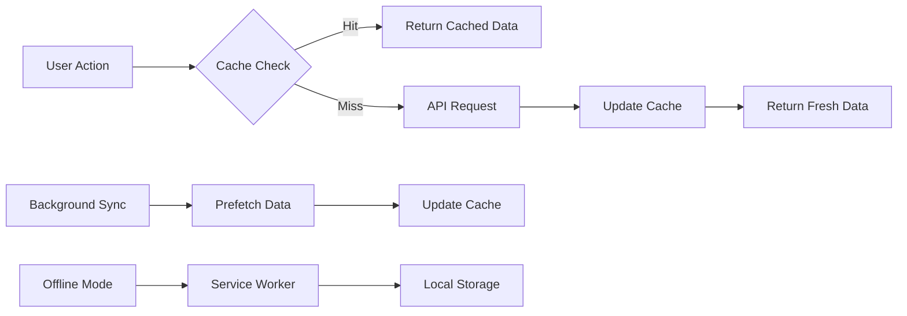

### Code Splitting and Lazy Loading

```typescript
// Route-based Code Splitting
const StudyDashboard = lazy(() => import('./pages/StudyDashboard'));
const TeacherPortal = lazy(() => import('./pages/TeacherPortal'));
const AdminConsole = lazy(() => import('./pages/AdminConsole'));

// Component with Suspense
<Suspense fallback={<LoadingSpinner />}>
  <Routes>
    <Route path="/study" element={<StudyDashboard />} />
    <Route path="/teacher" element={<TeacherPortal />} />
    <Route path="/admin" element={<AdminConsole />} />
  </Routes>
</Suspense>

// Feature-based Code Splitting
const FlashcardEngine = lazy(() => 
  import('./components/study/FlashcardEngine')
);

const AnalyticsDashboard = lazy(() => 
  import('./components/analytics/AnalyticsDashboard')
);
```

### Performance Monitoring Implementation

```typescript
// Performance Metrics Hook
const usePerformanceMetrics = () => {
  useEffect(() => {
    // Track Core Web Vitals
    getCLS(console.log);
    getFID(console.log);
    getLCP(console.log);
    
    // Track Custom Metrics
    const observer = new PerformanceObserver((list) => {
      for (const entry of list.getEntries()) {
        if (entry.entryType === 'measure') {
          analytics.track('performance_metric', {
            name: entry.name,
            duration: entry.duration,
          });
        }
      }
    });
    
    observer.observe({ entryTypes: ['measure'] });
    
    return () => observer.disconnect();
  }, []);
};

// Study Session Performance Tracking
const trackStudyPerformance = (sessionData: StudySession) => {
  const metrics = {
    session_duration: sessionData.duration,
    cards_reviewed: sessionData.cardCount,
    average_response_time: sessionData.averageResponseTime,
    accuracy_rate: sessionData.accuracyRate,
  };
  
  analytics.track('study_session_completed', metrics);
};
```

---

## Implementation Roadmap

### Phase 1: Foundation (Weeks 1-3)
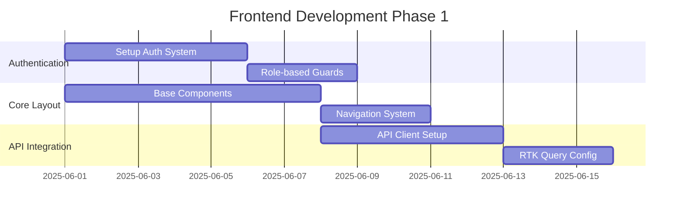

**Deliverables:**
- [ ] Authentication system with JWT handling
- [ ] Role-based route protection
- [ ] Base layout components (Header, Sidebar, Footer)
- [ ] API client with error handling
- [ ] State management setup (Redux Toolkit)

### Phase 2: Student Experience (Weeks 4-6)
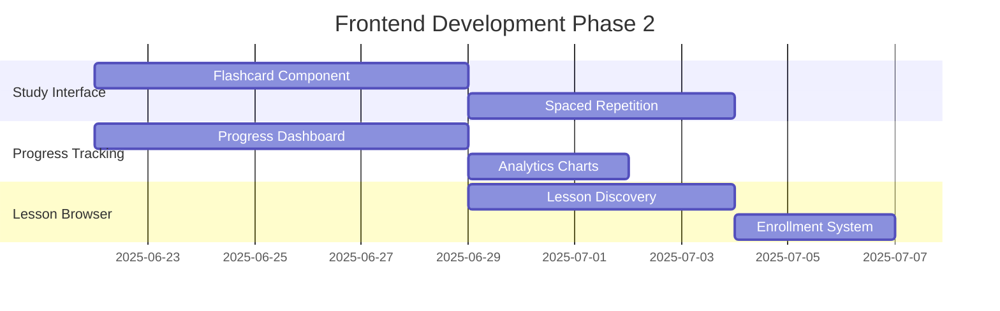

**Deliverables:**
- [ ] Interactive flashcard interface with SM-2 algorithm
- [ ] Progress visualization dashboard
- [ ] Lesson browsing and enrollment system
- [ ] Study session management
- [ ] Achievement and streak tracking

### Phase 3: Teacher Experience (Weeks 7-9)
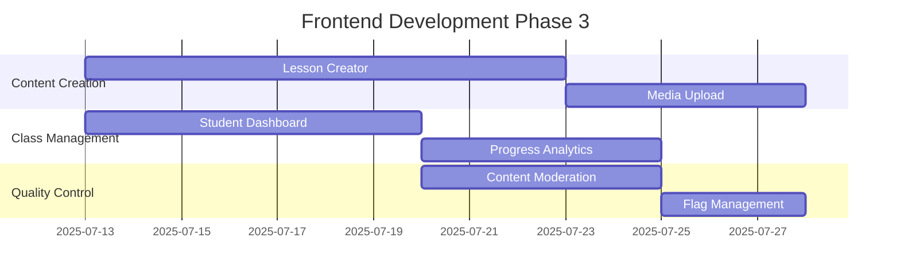

**Deliverables:**
- [ ] Rich lesson creation interface
- [ ] Audio/video upload and processing
- [ ] Student progress monitoring dashboard
- [ ] Class analytics and reporting
- [ ] Content moderation tools

### Phase 4: Admin Experience (Weeks 10-11)
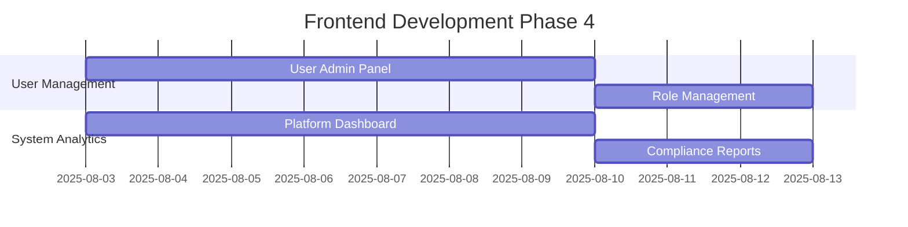

**Deliverables:**
- [ ] User management interface
- [ ] System-wide analytics dashboard
- [ ] Compliance reporting tools
- [ ] Platform health monitoring

### Phase 5: Optimization & Polish (Weeks 12-13)
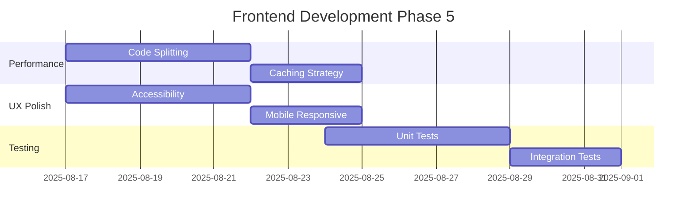

**Deliverables:**
- [ ] Performance optimization and code splitting
- [ ] Accessibility compliance (WCAG 2.1 AA)
- [ ] Mobile-responsive design
- [ ] Comprehensive testing suite
- [ ] Production deployment pipeline

---

## Technical Specifications

### API Endpoints Mapping

#### Authentication Endpoints
```typescript
interface AuthAPI {
  // POST /api/auth/login
  login(credentials: LoginCredentials): Promise<AuthResponse>;
  
  // POST /api/auth/register  
  register(userData: RegisterData): Promise<AuthResponse>;
  
  // POST /api/auth/refresh
  refreshToken(token: string): Promise<TokenResponse>;
  
  // POST /api/auth/logout
  logout(): Promise<void>;
}
```

#### Study Session Endpoints
```typescript
interface StudyAPI {
  // GET /api/study/cards-due/:userId
  getCardsDue(userId: string, limit?: number): Promise<FlashCard[]>;
  
  // POST /api/study/record-review
  recordReview(review: ReviewPayload): Promise<ReviewResult>;
  
  // GET /api/study/statistics/:userId
  getStudyStatistics(userId: string): Promise<StudyStatistics>;
  
  // GET /api/study/progress/:userId/:lessonId
  getLessonProgress(userId: string, lessonId: string): Promise<LessonProgress>;
}
```

#### Lesson Management Endpoints
```typescript
interface LessonAPI {
  // GET /api/lessons/user-lessons/:userId
  getUserLessons(userId: string, params: GetLessonsParams): Promise<Lesson[]>;
  
  // POST /api/lessons/create
  createLesson(lessonData: CreateLessonPayload): Promise<Lesson>;
  
  // PUT /api/lessons/:lessonId
  updateLesson(lessonId: string, updates: UpdateLessonPayload): Promise<Lesson>;
  
  // GET /api/lessons/:lessonId/analytics
  getLessonAnalytics(lessonId: string): Promise<LessonAnalytics>;
}
```

### Data Models and Interfaces

#### Core Entity Interfaces
```typescript
// User Management
interface User {
  id: string;
  email: string;
  name: string;
  role: 'student' | 'teacher' | 'admin' | 'moderator';
  avatar_url?: string;
  created_at: string;
  updated_at: string;
}

// Learning Content
interface Lesson {
  id: string;
  name: string;
  date: string;
  teacher_id: string;
  duration?: number;
  has_audio: boolean;
  has_transcript: boolean;
  has_summary: boolean;
  recording_path?: string;
  transcription_progress: number;
  created_at: string;
}

interface FlashCard {
  id: string;
  front_content: string;
  back_content: string;
  lesson_id: string;
  created_by: string;
  card_type: 'basic' | 'cloze' | 'multiple_choice' | 'true_false';
  difficulty_level: 1 | 2 | 3 | 4 | 5;
  status: 'pending' | 'approved' | 'rejected' | 'archived';
  tags: string[];
  created_at: string;
  updated_at: string;
}

// Progress Tracking
interface StudyProgress {
  id: string;
  student_id: string;
  lesson_id: string;
  cards_total: number;
  cards_reviewed: number;
  cards_mastered: number;
  first_review_date?: string;
  last_review_date?: string;
  next_review_date?: string;
  average_quality_rating?: number;
  total_review_time_ms: number;
}

interface ReviewSession {
  id: string;
  card_id: string;
  student_id: string;
  quality_rating: 0 | 1 | 2 | 3 | 4 | 5;
  response_time_ms: number;
  scheduled_for: string;
  completed_at?: string;
  interval_days: number;
  ease_factor: number;
  repetition_count: number;
}
```

#### UI State Interfaces
```typescript
// Study Interface State
interface StudySessionState {
  isActive: boolean;
  currentCard: FlashCard | null;
  cardsDue: FlashCard[];
  sessionStartTime: number;
  reviewCount: number;
  sessionStats: {
    totalCards: number;
    correctAnswers: number;
    averageResponseTime: number;
    qualityDistribution: Record<string, number>;
  };
}

// Analytics Interface State
interface AnalyticsState {
  timeRange: '7d' | '30d' | '90d' | '1y';
  chartData: {
    daily: DailyProgressData[];
    weekly: WeeklyProgressData[];
    monthly: MonthlyProgressData[];
  };
  metrics: {
    totalReviews: number;
    averageQuality: number;
    studyStreak: number;
    cardsLearned: number;
    cardsMastered: number;
  };
}
```

### Component Architecture Specifications

#### Flashcard Component Architecture
```typescript
interface FlashcardProps {
  card: FlashCard;
  showAnswer: boolean;
  onFlip: () => void;
  onReview: (quality: number, responseTime: number) => void;
  className?: string;
}

interface FlashcardState {
  startTime: number;
  isFlipped: boolean;
  selectedQuality?: number;
}

// Flashcard Component Implementation Pattern
const FlashcardComponent: React.FC<FlashcardProps> = ({
  card,
  showAnswer,
  onFlip,
  onReview,
  className
}) => {
  const [startTime] = useState(Date.now());
  
  const handleQualitySelect = (quality: number) => {
    const responseTime = Date.now() - startTime;
    onReview(quality, responseTime);
  };
  
  return (
    <Card className={className}>
      <CardContent>
        {!showAnswer ? (
          <QuestionView content={card.front_content} onFlip={onFlip} />
        ) : (
          <AnswerView 
            content={card.back_content}
            onQualitySelect={handleQualitySelect}
          />
        )}
      </CardContent>
    </Card>
  );
};
```

#### Analytics Dashboard Architecture
```typescript
interface AnalyticsDashboardProps {
  userId: string;
  lessonId?: string;
  timeRange: TimeRange;
  refreshInterval?: number;
}

const AnalyticsDashboard: React.FC<AnalyticsDashboardProps> = ({
  userId,
  lessonId,
  timeRange,
  refreshInterval = 30000
}) => {
  const { data: analytics, isLoading } = useGetAnalyticsQuery({
    userId,
    lessonId,
    timeRange
  }, {
    pollingInterval: refreshInterval
  });
  
  return (
    <Grid container spacing={3}>
      <Grid item xs={12} md={6}>
        <MetricsCard metrics={analytics?.metrics} />
      </Grid>
      <Grid item xs={12} md={6}>
        <ProgressChart data={analytics?.chartData} />
      </Grid>
      <Grid item xs={12}>
        <RecentActivity activities={analytics?.recentActivity} />
      </Grid>
    </Grid>
  );
};
```

---

## Conclusion

This frontend architecture guide provides a comprehensive blueprint for building the Spaced Repetition Learning System. The architecture emphasizes:

- **User-Centric Design**: Role-based interfaces optimized for each user type
- **Scalable Architecture**: Modular components and state management patterns
- **Performance**: Code splitting, caching, and optimization strategies
- **Security**: Authentication, authorization, and data protection
- **Educational Focus**: Spaced repetition algorithms and learning analytics

The implementation roadmap provides a clear path from foundation to full-featured platform, with specific deliverables and timelines for each phase. This guide should serve as the primary reference for frontend development decisions and implementation strategies.

---

**Document Version**: 1.0.0  
**Next Review**: 2025-07-01  
**Maintenance**: Update with each major feature addition  
**Contact**: Frontend Architecture Team