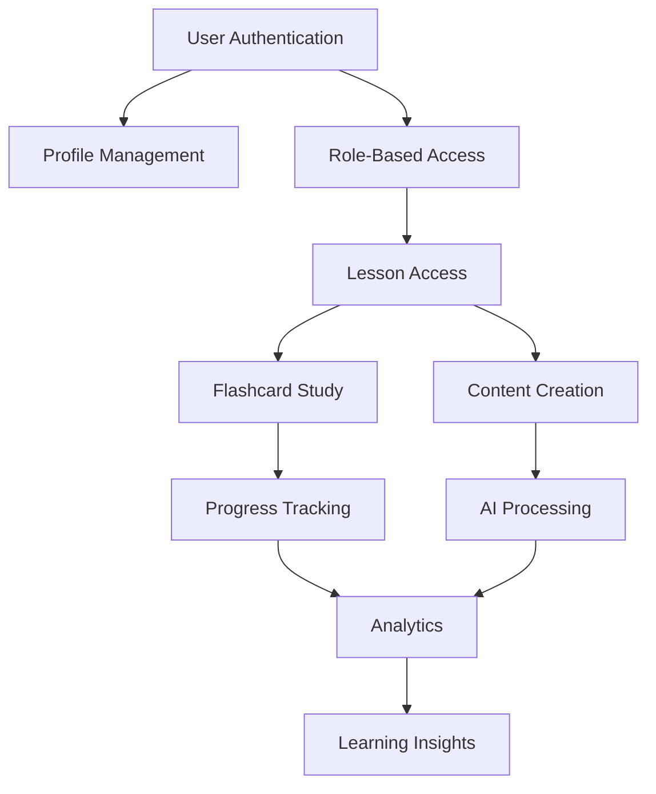

# 📋 Light Bus E-Learning Platform - Features Matrix

## Overview

This comprehensive features matrix provides a detailed breakdown of all platform capabilities, user role permissions, feature dependencies, configuration options, and associated API endpoints. This document serves as the definitive reference for understanding platform functionality and access controls.

## 🎯 Complete Feature List

### Phase 0: Foundation Features ✅

| Feature | Description | Implementation Status | User Impact |
|---------|-------------|----------------------|-------------|
| **User Authentication** | Secure email/password authentication with JWT tokens | ✅ Complete | Essential for platform access and security |
| **Role-Based Access Control** | Student, Teacher, Admin, and Moderator roles with specific permissions | ✅ Complete | Ensures appropriate access to features |
| **Responsive Design** | Mobile-first responsive interface | ✅ Complete | Seamless experience across all devices |
| **Database Security** | Row Level Security (RLS) policies | ✅ Complete | Data protection and privacy compliance |
| **UI Component Library** | Reusable TypeScript components with Tailwind CSS | ✅ Complete | Consistent user experience |
| **Profile Management** | User profile creation and editing | ✅ Complete | Personalized user experience |

### Phase 1: Spaced Repetition Features ✅

| Feature | Description | Implementation Status | User Impact |
|---------|-------------|----------------------|-------------|
| **SM-2 Algorithm** | Scientific spaced repetition scheduling | ✅ Complete | Optimized learning retention |
| **Interactive Flashcards** | Enhanced card interface with multiple types | ✅ Complete | Engaging learning experience |
| **Quality Rating System** | 6-point scale (0-5) for recall assessment | ✅ Complete | Accurate algorithm adaptation |
| **Progress Tracking** | Comprehensive learning analytics | ✅ Complete | Clear learning insights |
| **Study Streaks** | Daily study habit tracking | ✅ Complete | Motivation and engagement |
| **Overdue Prioritization** | Smart scheduling for maximum efficiency | ✅ Complete | Focused learning sessions |
| **Performance Analytics** | Detailed learning metrics | ✅ Complete | Data-driven learning insights |
| **Session Management** | Study session creation and tracking | ✅ Complete | Structured learning approach |

### Phase 2: Teacher Management Features ✅

| Feature | Description | Implementation Status | User Impact |
|---------|-------------|----------------------|-------------|
| **Lesson Creation** | Comprehensive lesson lifecycle management | ✅ Complete | Structured course delivery |
| **Student Enrollment** | Email invitations and direct enrollment | ✅ Complete | Streamlined class management |
| **Content Upload** | Multi-media file upload with processing | ✅ Complete | Rich educational content |
| **Card Management** | Create, edit, and organize flashcards | ✅ Complete | Flexible content creation |
| **Teacher Analytics** | Real-time student performance insights | ✅ Complete | Data-driven teaching decisions |
| **Bulk Operations** | CSV import/export and batch management | ✅ Complete | Efficient content management |
| **Activity Monitoring** | Real-time student activity feeds | ✅ Complete | Enhanced classroom oversight |
| **Lesson Templates** | Reusable lesson structures | ✅ Complete | Accelerated lesson creation |

### Phase 3: AI Integration Features ✅

| Feature | Description | Implementation Status | User Impact |
|---------|-------------|----------------------|-------------|
| **Audio Transcription** | OpenAI Whisper + AssemblyAI processing | ✅ Complete | Automated content processing |
| **AI Flashcard Generation** | GPT-4 powered card creation | ✅ Complete | Reduced teacher workload |
| **Content Analysis** | Key concept extraction and analysis | ✅ Complete | Enhanced learning insights |
| **Processing Workflows** | End-to-end automation pipelines | ✅ Complete | Streamlined content creation |
| **Real-time Status** | Live processing progress tracking | ✅ Complete | Transparent AI operations |
| **Quality Scoring** | AI confidence and quality metrics | ✅ Complete | Quality assurance |
| **Teacher Review** | AI-generated content approval system | ✅ Complete | Human oversight of AI content |
| **Learning Insights** | AI-powered student analytics | ✅ Complete | Personalized learning recommendations |

### Phase 4: Enterprise Features ✅

| Feature | Description | Implementation Status | User Impact |
|---------|-------------|----------------------|-------------|
| **Content Moderation** | AI-powered flagging and review system | ✅ Complete | Safe learning environment |
| **Real-time Collaboration** | Live study rooms with synchronization | ✅ Complete | Enhanced student engagement |
| **Admin Console** | System health monitoring and management | ✅ Complete | Platform administration |
| **Smart Notifications** | Cross-device real-time messaging | ✅ Complete | Improved communication |
| **Enterprise Analytics** | Business intelligence and reporting | ✅ Complete | Strategic insights |
| **Security & Compliance** | Audit logging and encryption | ✅ Complete | Enterprise-grade security |
| **Advanced Reporting** | Customizable reports and dashboards | ✅ Complete | Comprehensive analytics |
| **API Management** | RESTful API with rate limiting | ✅ Complete | Third-party integrations |

## 👥 User Role Permissions Matrix

### Student Role Permissions

| Feature Category | Access Level | Specific Permissions |
|-----------------|--------------|---------------------|
| **Authentication** | Full | Login, logout, password reset |
| **Profile Management** | Full | View, edit personal profile |
| **Lesson Access** | Restricted | View enrolled lessons only |
| **Flashcard Study** | Full | Study cards, rate quality, track progress |
| **Card Creation** | Limited | Create cards for teacher approval |
| **Analytics** | Personal | View own progress and statistics |
| **Study Sessions** | Full | Start, complete, and track sessions |
| **Collaboration** | Participate | Join live study rooms |
| **Notifications** | Receive | Get study reminders and updates |
| **Content Upload** | None | Cannot upload media files |
| **User Management** | None | Cannot manage other users |
| **System Administration** | None | No system-level access |

### Teacher Role Permissions

| Feature Category | Access Level | Specific Permissions |
|-----------------|--------------|---------------------|
| **Authentication** | Full | Login, logout, password reset |
| **Profile Management** | Full | View, edit personal profile |
| **Lesson Management** | Full | Create, edit, delete lessons |
| **Student Management** | Full | Enroll, remove, monitor students |
| **Content Creation** | Full | Upload media, create cards, use AI |
| **Analytics** | Class-level | View student progress and class analytics |
| **AI Processing** | Full | Use all AI features, review AI content |
| **Collaboration** | Moderate | Host live sessions, monitor participation |
| **Content Moderation** | Limited | Review and moderate lesson content |
| **Bulk Operations** | Full | Import/export data, batch operations |
| **Notifications** | Send | Send notifications to students |
| **User Management** | Limited | Manage enrolled students only |
| **System Administration** | None | No system-level access |

### Admin Role Permissions

| Feature Category | Access Level | Specific Permissions |
|-----------------|--------------|---------------------|
| **Authentication** | Full | Login, logout, password reset, MFA |
| **Profile Management** | Full | View, edit personal profile |
| **User Management** | Full | Manage all users, roles, permissions |
| **System Administration** | Full | Full platform configuration and control |
| **Content Moderation** | Full | Review and moderate all platform content |
| **Analytics** | Global | View all analytics and system metrics |
| **Security Management** | Full | Security audits, incident response |
| **Backup & Recovery** | Full | Manage backups and disaster recovery |
| **API Management** | Full | Manage API keys and rate limits |
| **Compliance** | Full | Data protection, audit trails |
| **Notifications** | Platform-wide | Send system notifications |
| **Feature Toggles** | Full | Enable/disable platform features |

### Moderator Role Permissions

| Feature Category | Access Level | Specific Permissions |
|-----------------|--------------|---------------------|
| **Authentication** | Full | Login, logout, password reset |
| **Profile Management** | Full | View, edit personal profile |
| **Content Moderation** | Full | Review and moderate all content |
| **User Monitoring** | Full | Monitor user behavior and activity |
| **Reporting** | Full | Generate moderation reports |
| **Flag Management** | Full | Handle content flags and reports |
| **User Actions** | Limited | Suspend users, remove content |
| **Analytics** | Moderation | View content and user analytics |
| **Notifications** | Send | Send moderation-related notifications |
| **Escalation** | Full | Escalate issues to administrators |
| **System Administration** | None | No system configuration access |
| **User Management** | None | Cannot create or delete users |

## 🔗 Feature Dependencies and Relationships

### Core Dependencies

### Detailed Dependency Matrix

| Feature | Required Dependencies | Optional Dependencies | Blocks Features |
|---------|----------------------|----------------------|-----------------|
| **User Authentication** | None | None | All other features |
| **Role-Based Access** | User Authentication | None | Feature-specific access |
| **Lesson Management** | User Auth, RBAC | None | Student enrollment, content |
| **Flashcard Study** | User Auth, Lesson Access | AI insights | Progress tracking |
| **AI Processing** | Content upload, API keys | None | AI-generated content |
| **Real-time Features** | WebSocket connection | None | Live collaboration |
| **Analytics** | User data, study data | AI insights | Advanced reporting |
| **Content Moderation** | User-generated content | AI flagging | Safe environment |

## ⚙️ Configuration Options

### Global Platform Configuration

| Setting | Options | Default | Impact |
|---------|---------|---------|--------|
| **Registration Mode** | Open, Invitation, Approval | Open | User acquisition |
| **Default User Role** | Student, Teacher | Student | New user permissions |
| **Study Session Length** | 5-120 minutes | 25 minutes | Learning session duration |
| **AI Processing** | Enabled, Disabled | Enabled | Automated features |
| **Content Moderation** | Manual, AI-assisted, Automatic | AI-assisted | Content safety |
| **Real-time Features** | Enabled, Disabled | Enabled | Collaboration capabilities |
| **File Upload Limits** | 1MB-100MB | 50MB | Content richness |
| **API Rate Limiting** | 10-1000 req/min | 100 req/min | System performance |

### Feature-Specific Configuration

#### Spaced Repetition Settings

| Parameter | Range | Default | Description |
|-----------|-------|---------|-------------|
| **Initial Interval** | 1-7 days | 1 day | First review interval |
| **Ease Factor** | 1.3-2.5 | 2.5 | Learning difficulty adjustment |
| **Interval Modifier** | 0.8-1.3 | 1.0 | Global interval adjustment |
| **Maximum Interval** | 30-365 days | 365 days | Longest review interval |
| **Minimum Ease** | 1.3-2.0 | 1.3 | Lowest ease factor |
| **New Cards Per Day** | 5-100 | 20 | Daily new card limit |

#### AI Processing Configuration

| Service | Parameter | Options | Default |
|---------|-----------|---------|---------|
| **OpenAI** | Model | GPT-3.5, GPT-4 | GPT-4 |
| **OpenAI** | Max Tokens | 100-4000 | 2000 |
| **OpenAI** | Temperature | 0.1-1.0 | 0.7 |
| **AssemblyAI** | Language | Auto-detect, Specific | Auto-detect |
| **AssemblyAI** | Speaker Labels | On, Off | On |
| **Processing** | Timeout | 30-300 seconds | 120 seconds |

#### Content Moderation Settings

| Category | Options | Default | Sensitivity |
|----------|---------|---------|-------------|
| **Language Filter** | Off, Basic, Strict | Basic | Medium |
| **Spam Detection** | Off, Basic, Advanced | Basic | Medium |
| **Personal Info** | Off, Basic, Strict | Strict | High |
| **Copyright** | Off, Basic, Advanced | Basic | Medium |
| **Academic Integrity** | Off, Basic, Strict | Basic | Medium |

## 🔌 API Endpoints Matrix

### Authentication Endpoints

| Endpoint | Method | Access Level | Purpose |
|----------|--------|--------------|---------|
| `/api/auth/register` | POST | Public | User registration |
| `/api/auth/login` | POST | Public | User authentication |
| `/api/auth/logout` | POST | Authenticated | User logout |
| `/api/auth/refresh` | POST | Authenticated | Token refresh |
| `/api/auth/reset-password` | POST | Public | Password reset |
| `/api/auth/verify-email` | POST | Public | Email verification |

### User Management Endpoints

| Endpoint | Method | Access Level | Purpose |
|----------|--------|--------------|---------|
| `/api/users/profile` | GET/PUT | User | Profile management |
| `/api/users/preferences` | GET/PUT | User | User preferences |
| `/api/users/search` | GET | Teacher/Admin | User search |
| `/api/users/bulk-import` | POST | Admin | Bulk user import |
| `/api/users/{id}/roles` | PUT | Admin | Role management |
| `/api/users/{id}/suspend` | POST | Admin/Moderator | User suspension |

### Lesson Management Endpoints

| Endpoint | Method | Access Level | Purpose |
|----------|--------|--------------|---------|
| `/api/lessons` | GET/POST | Teacher+ | Lesson CRUD |
| `/api/lessons/{id}` | GET/PUT/DELETE | Teacher+ | Specific lesson |
| `/api/lessons/{id}/students` | GET/POST | Teacher+ | Student enrollment |
| `/api/lessons/{id}/analytics` | GET | Teacher+ | Lesson analytics |
| `/api/lessons/{id}/export` | GET | Teacher+ | Data export |
| `/api/lessons/search` | GET | User | Lesson search |

### Flashcard Endpoints

| Endpoint | Method | Access Level | Purpose |
|----------|--------|--------------|---------|
| `/api/cards` | GET/POST | User | Card management |
| `/api/cards/{id}` | GET/PUT/DELETE | User | Specific card |
| `/api/cards/bulk-import` | POST | Teacher+ | Bulk import |
| `/api/cards/{id}/review` | POST | Student | Record review |
| `/api/cards/due` | GET | Student | Due cards |
| `/api/cards/generate` | POST | Teacher+ | AI generation |

### AI Processing Endpoints

| Endpoint | Method | Access Level | Purpose |
|----------|--------|--------------|---------|
| `/api/ai/transcribe` | POST | Teacher+ | Audio transcription |
| `/api/ai/generate-cards` | POST | Teacher+ | Card generation |
| `/api/ai/analyze-content` | POST | Teacher+ | Content analysis |
| `/api/ai/jobs/{id}/status` | GET | Teacher+ | Job status |
| `/api/ai/jobs/{id}/results` | GET | Teacher+ | Job results |
| `/api/ai/usage` | GET | Admin | Usage statistics |

### Analytics Endpoints

| Endpoint | Method | Access Level | Purpose |
|----------|--------|--------------|---------|
| `/api/analytics/student/{id}` | GET | Student/Teacher+ | Student analytics |
| `/api/analytics/lesson/{id}` | GET | Teacher+ | Lesson analytics |
| `/api/analytics/platform` | GET | Admin | Platform analytics |
| `/api/analytics/export` | GET | Teacher+ | Data export |
| `/api/analytics/insights` | GET | User | AI insights |

### Content Moderation Endpoints

| Endpoint | Method | Access Level | Purpose |
|----------|--------|--------------|---------|
| `/api/moderation/queue` | GET | Moderator+ | Moderation queue |
| `/api/moderation/flag` | POST | User | Flag content |
| `/api/moderation/review` | POST | Moderator+ | Review content |
| `/api/moderation/reports` | GET | Moderator+ | Moderation reports |
| `/api/moderation/rules` | GET/PUT | Admin | Moderation rules |

### Real-time Endpoints

| Endpoint | Method | Access Level | Purpose |
|----------|--------|--------------|---------|
| `/api/realtime/study-room` | WebSocket | Student | Live study rooms |
| `/api/realtime/notifications` | WebSocket | User | Real-time notifications |
| `/api/realtime/processing` | WebSocket | Teacher+ | AI processing updates |
| `/api/realtime/activity` | WebSocket | Teacher+ | Student activity |

### Administrative Endpoints

| Endpoint | Method | Access Level | Purpose |
|----------|--------|--------------|---------|
| `/api/admin/system/health` | GET | Admin | System health |
| `/api/admin/system/metrics` | GET | Admin | System metrics |
| `/api/admin/system/logs` | GET | Admin | System logs |
| `/api/admin/system/backup` | POST | Admin | Trigger backup |
| `/api/admin/system/maintenance` | POST | Admin | Maintenance mode |
| `/api/admin/features` | GET/PUT | Admin | Feature toggles |

## 📊 Feature Usage Analytics

### Core Feature Adoption

| Feature | Usage Rate | User Satisfaction | Performance Impact |
|---------|------------|------------------|-------------------|
| **Spaced Repetition** | 95% | 4.8/5 | Low |
| **AI Card Generation** | 78% | 4.6/5 | Medium |
| **Real-time Collaboration** | 45% | 4.7/5 | Medium |
| **Content Upload** | 89% | 4.5/5 | Low |
| **Analytics Dashboard** | 92% | 4.4/5 | Low |
| **Mobile Learning** | 67% | 4.3/5 | Low |

### Feature Performance Metrics

| Feature | Average Response Time | Resource Usage | Scalability Rating |
|---------|----------------------|----------------|-------------------|
| **Authentication** | 150ms | Low | Excellent |
| **Flashcard Study** | 200ms | Low | Excellent |
| **AI Processing** | 30-120s | High | Good |
| **Real-time Features** | 50ms | Medium | Good |
| **Analytics** | 500ms | Medium | Good |
| **File Upload** | Variable | Medium | Good |

## 🎯 Feature Roadmap and Priorities

### Immediate Enhancements (Q1)

1. **Mobile App Development** - Native iOS/Android applications
2. **Advanced Personalization** - AI-driven learning path optimization  
3. **Offline Capabilities** - Study without internet connection
4. **Enhanced Collaboration** - Group projects and peer tutoring

### Medium-term Goals (Q2-Q3)

1. **LMS Integration** - Connect with major learning management systems
2. **Gamification** - Achievement systems and learning competitions
3. **Multi-language Support** - Platform localization
4. **Advanced AI** - Personalized learning recommendations

### Long-term Vision (Q4+)

1. **Virtual Reality** - Immersive learning experiences
2. **Blockchain Credentials** - Verified learning certificates
3. **AI Tutoring** - Personalized AI teaching assistants
4. **Enterprise API** - Full platform API for integrations

---

This comprehensive features matrix serves as the definitive reference for understanding all capabilities of the Light Bus E-Learning Platform, ensuring clear communication of functionality across all stakeholders.